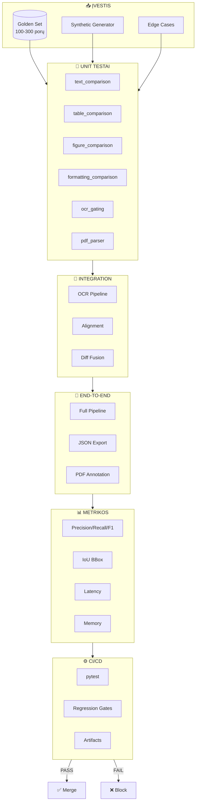
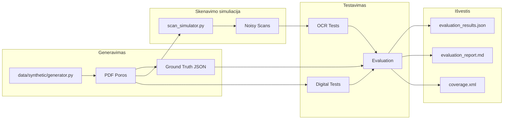
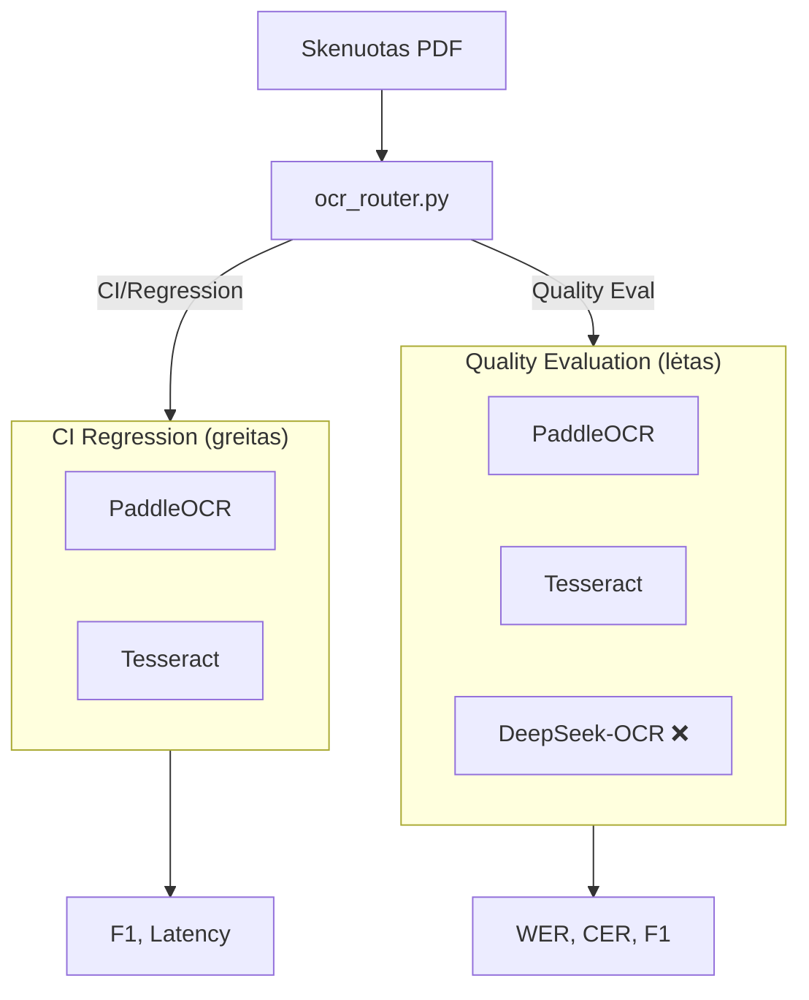
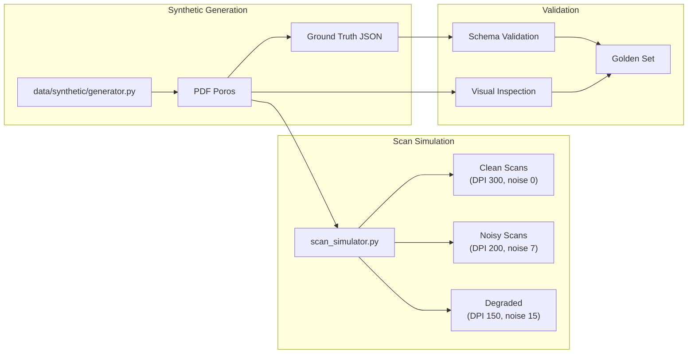
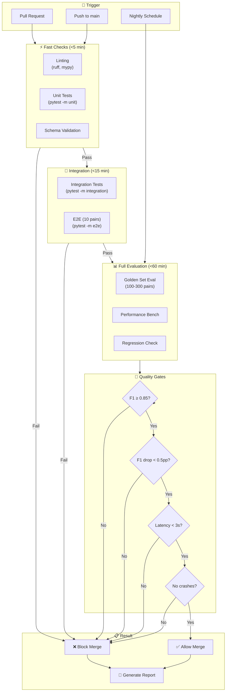
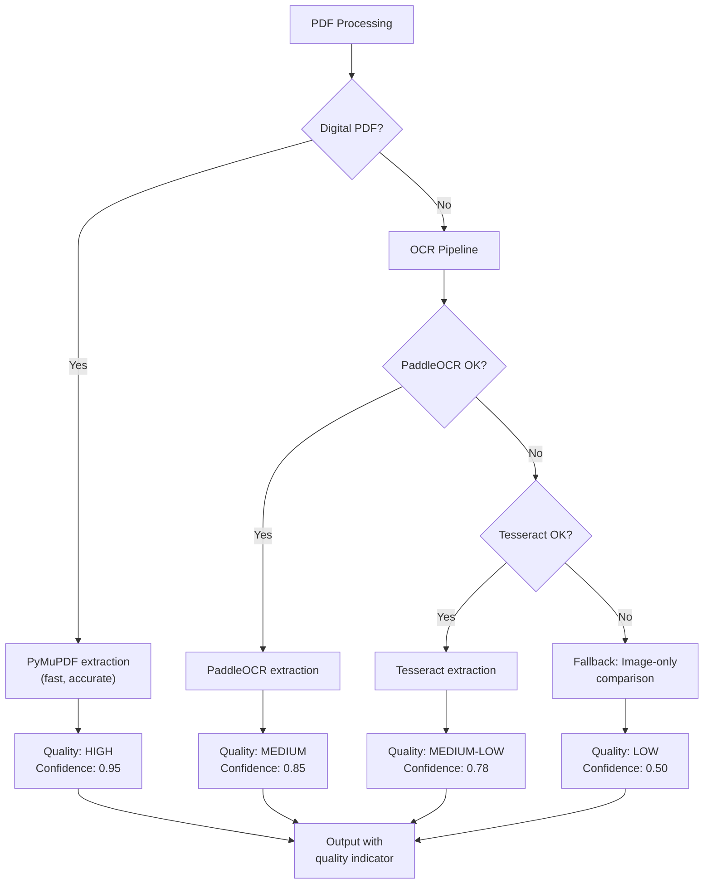

# PDF Dokumentų Palyginimo Sistemos Testavimo Planas

**Versija**: 1.0  
**Data**: 2026-01-03  
**Atnaujinta**: 2026-01-04 (užpildyta faktiniais testų rezultatais)  
**Autorius**: QA/ML Evaluation  
**Statusas**: Akademinis atsiskaitymas

---

## Turinys

1. [Įvadas ir Testavimo Apimtis](#1-įvadas-ir-testavimo-apimtis)
2. [Testavimo Proceso Architektūra](#2-testavimo-proceso-architektūra)
3. [Testų Lygiai](#3-testų-lygiai)
4. [Kategorijų Testavimo Matrica](#4-kategorijų-testavimo-matrica)
5. [Konkretūs Test Case'ai](#5-konkretūs-test-caseai)
6. [Metrikos ir Tiksliniai Slenksčiai](#6-metrikos-ir-tiksliniai-slenksčiai)
7. [Golden Dataset Strategija](#7-golden-dataset-strategija)
8. [CI/CD Automatizavimas](#8-cicd-automatizavimas)
9. [Rizikos ir Mitigacijos](#9-rizikos-ir-mitigacijos)
10. [Definition of Done ir Atsiskaitymo Artefaktai](#10-definition-of-done-ir-atsiskaitymo-artefaktai)

---

## 1. Įvadas ir Testavimo Apimtis

### 1.1 Sistemos aprašymas

PDF dokumentų palyginimo AI sistema lygina ORIGINAL.pdf ir MODIFIED.pdf, generuodama struktūrizuotą pakeitimų žurnalą (change-log) ir vizualinį pažymėjimą.

**Pagrindiniai komponentai**:
- **Ekstrakcija**: PyMuPDF (skaitmeniniai PDF), OCR varikliai (skenuoti PDF)
- **OCR varikliai**: PaddleOCR, Tesseract, DeepSeek-OCR
- **Palyginimas**: Teksto, formatavimo, layout, lentelių, figūrų diff
- **Išvestis**: JSON change-log + annotated PDF/images

**Išvesties struktūra**:
```json
{
  "page": 1,
  "type": "insert|delete|replace",
  "old_text": "...",
  "new_text": "...",
  "bbox": {"x": 0.1, "y": 0.2, "width": 0.3, "height": 0.05},
  "confidence": 0.85,
  "engine": "paddle|tesseract|native"
}
```

### 1.2 Testavimo apimties kategorijos

| # | Kategorija | Aprašymas | Modulis |
|---|------------|-----------|---------|
| 1 | **Tekstiniai pakeitimai** | Žodžių, sakinių įterpimas/šalinimas/keitimas | `text_comparison.py` |
| 2 | **Punktuacija** | Skyrybos ženklų pakeitimai (., , ; : ! ?) | `text_normalizer.py` |
| 3 | **Didžiosios/mažosios** | Case sensitivity pakeitimai | `ocr_gating.py` |
| 4 | **Tarpai/whitespace** | Tarpų, eilučių pakeitimai | `text_normalizer.py` |
| 5 | **Šrifto dydis** | Font size pakeitimai (±1pt slenkstis) | `formatting_comparison.py` |
| 6 | **Šrifto šeima** | Font family pakeitimai | `formatting_comparison.py` |
| 7 | **Stilius (bold/italic)** | Teksto stiliaus pakeitimai | `formatting_comparison.py` |
| 8 | **Spalva** | Teksto/fono spalvos pakeitimai | `formatting_comparison.py` |
| 9 | **BBox pozicija** | Elemento koordinačių poslinkiai | `layout_analyzer.py` |
| 10 | **Lentelės** | Celių turinys, struktūra, kraštinės | `table_comparison.py` |
| 11 | **Antraštės/poraštės** | Header/footer pakeitimai | `header_footer_detector.py` |
| 12 | **Puslapių numeracija** | Page number pakeitimai | `line_extractor.py` |
| 13 | **Figūros/vaizdai** | Paveikslėlių pakeitimai (pHash) | `figure_comparison.py` |
| 14 | **Formulės** *(planned)* | Matematinių formulių pakeitimai | `formula_comparison.py` |

### 1.3 Skaitmeninių PDF ekstrakcija (PyMuPDF)

Sistema naudoja `extraction/pdf_parser.py` su PyMuPDF biblioteka skaitmeninių PDF apdorojimui.

| Funkcija | Granuliarumas | Naudojimas |
|----------|---------------|------------|
| `parse_pdf_words_as_lines()` | Žodžių → LINE blokai | Tikslus diff su word-level bbox |
| `parse_pdf()` | Blokų lygis | Greitesnis, paragraph-ish |

**Duomenų struktūra**:
```python
PageData(
    page_num: int,
    width: float, height: float,
    blocks: List[TextBlock],  # LINE granuliarumas
    metadata: dict            # rotation, cropbox, extraction_method
)

TextBlock(
    text: str,
    bbox: Dict[str, float],   # {"x": 0.1, "y": 0.2, "width": 0.3, "height": 0.05}
    style: Style,             # font, size, bold, italic, color
    metadata: {
        "words": [            # Word-level data
            {"text": "Hello", "bbox": {...}, "conf": 1.0, "style": {...}}
        ]
    }
)

Style(
    font: Optional[str],      # "Calibri", "Arial", etc.
    size: Optional[float],    # 12.0, 14.5, etc.
    bold: bool,               # PyMuPDF flags & 16
    italic: bool,             # PyMuPDF flags & 2
    color: Optional[Tuple]    # (R, G, B) 0-255
)
```

**PyMuPDF specifika**:
- Flags: `TEXT_PRESERVE_LIGATURES | TEXT_PRESERVE_WHITESPACE`
- Font subset normalizacija: `ABCDEF+Calibri` → `Calibri`
- Color extraction: integer → RGB tuple `(color >> 16) & 0xFF, ...`
- BBox normalizacija: `normalize_page_bboxes()` konvertuoja į 0-1 koordinates

---

## 2. Testavimo Proceso Architektūra

### 2.1 Aukšto lygio testavimo diagrama



### 2.2 Testavimo duomenų srautas



### 2.3 OCR variklių testavimo strategija



> **Pastaba**: DeepSeek-OCR šiame etape (atsiskaitymui) **nevertinamas** ir todėl nėra CI/regression pipeline dalis. Jei reikia (atskirai nuo atsiskaitymo), jis paleidžiamas tik rankiniu režimu.

> **Šiame etape (atsiskaitymui)**: DeepSeek-OCR **nevertinamas** ir **neįtraukiamas** į lenteles/grafikus (tik PaddleOCR ir Tesseract skenuotiems PDF; PyMuPDF – skaitmeniniams).

---

## 3. Testų Lygiai

### 3.1 Lygių hierarchija

```
┌─────────────────────────────────────────────────────────────┐
│  7. UAT (User Acceptance)                                   │
│     └─ Gradio UI validacija, end-user scenarijai            │
├─────────────────────────────────────────────────────────────┤
│  6. Performance                                              │
│     └─ Latency <3s/page, memory stability, scalability      │
├─────────────────────────────────────────────────────────────┤
│  5. Robustness                                               │
│     └─ Edge cases, corrupted PDF, noisy scans, Unicode      │
├─────────────────────────────────────────────────────────────┤
│  4. Regression                                               │
│     └─ Golden set, OCR noise filter, baseline comparison    │
├─────────────────────────────────────────────────────────────┤
│  3. End-to-End                                               │
│     └─ Full pipeline: PDF→JSON/annotated output             │
├─────────────────────────────────────────────────────────────┤
│  2. Integration                                              │
│     └─ OCR→Alignment→Diff→Fusion chain                      │
├─────────────────────────────────────────────────────────────┤
│  1. Unit                                                     │
│     └─ Individual module functions                          │
└─────────────────────────────────────────────────────────────┘
```

### 3.2 Lygių aprašymas

| Lygis | Tikslas | Įrankiai | Vykdymo dažnis |
|-------|---------|----------|----------------|
| **Unit** | Modulių funkcijų korektiškumas | pytest, mock | Kiekvienas commit |
| **Integration** | Komponentų sąveika | pytest, fixtures | Kiekvienas PR |
| **End-to-End** | Pilno pipeline validacija | pytest, golden set | Prieš merge |
| **Regression** | Baseline palaikymas | pytest-benchmark | Nightly |
| **Robustness** | Edge case atsparumas | fuzzing, edge data | Weekly |
| **Performance** | Latency/memory tikslai | pytest-benchmark, memory_profiler | Release |
| **UAT** | Vartotojo priėmimas | Manual, Gradio UI | Sprint end |

---

## 4. Kategorijų Testavimo Matrica

### 4.1 Pakeitimų kategorijų coverage matrica

| # | Kategorija | Unit | Integ | E2E | Regres | Robust | Perf | Pass Kriterijai |
|---|------------|:----:|:-----:|:---:|:------:|:------:|:----:|-----------------|
| 1 | **Teksto įterpimas** | ✅ | ✅ | ✅ | ✅ | ✅ | ✅ | F1 ≥ 0.85 |
| 2 | **Teksto šalinimas** | ✅ | ✅ | ✅ | ✅ | ✅ | ✅ | F1 ≥ 0.85 |
| 3 | **Teksto pakeitimas** | ✅ | ✅ | ✅ | ✅ | ✅ | ✅ | F1 ≥ 0.85 |
| 4 | **Punktuacija** | ✅ | ✅ | ✅ | ✅ | ⚠️ | - | Precision ≥ 0.80 |
| 5 | **Whitespace** | ✅ | ✅ | ✅ | ✅ | ⚠️ | - | Filter accuracy ≥ 0.90 |
| 6 | **Šrifto dydis** | ✅ | ✅ | ✅ | ✅ | - | - | F1 ≥ 0.80, ±1pt tolerance |
| 7 | **Šrifto šeima** | ✅ | ✅ | ✅ | ⚠️ | - | - | F1 ≥ 0.75 |
| 8 | **Bold/Italic** | ✅ | ✅ | ✅ | ⚠️ | - | - | F1 ≥ 0.75 |
| 9 | **Spalvos** | ✅ | ✅ | ✅ | - | - | - | ΔE < 10 RGB |
| 10 | **BBox pozicija** | ✅ | ✅ | ✅ | ✅ | ✅ | - | IoU > 0.80 |
| 11 | **Lentelės** | ✅ | ✅ | ✅ | ✅ | ✅ | ✅ | Cell F1 ≥ 0.80 |
| 12 | **Antraštės/poraštės** | ✅ | ✅ | ✅ | ✅ | - | - | Detection ≥ 0.90 |
| 13 | **Numeracija** | ✅ | ✅ | ✅ | - | - | - | Accuracy ≥ 0.95 |
| 14 | **Figūros** | ✅ | ✅ | ✅ | ✅ | ✅ | - | pHash dist < 8 |
| 15 | **Formulės** *(planned)* | 🔜 | 🔜 | 🔜 | 🔜 | - | - | *TBD* |

**Legenda**: ✅ Pilnas coverage | ⚠️ Dalinis | 🔜 Planned | - N/A

### 4.2 OCR variklių testavimo matrica

| Variklis | Unit | Regression | WER Test | Latency | CI Pipeline |
|----------|:----:|:----------:|:--------:|:-------:|:-----------:|
| **PaddleOCR** | ✅ | ✅ | ✅ | ✅ | ✅ |
| **Tesseract** | ✅ | ✅ | ✅ | ✅ | ✅ |
| **DeepSeek** | ✅ | ❌* | ✅ | ⚠️ | ❌* |
| **Native (PyMuPDF)** | ✅ | ✅ | N/A | ✅ | ✅ |

*\*DeepSeek šiame etape (atsiskaitymui) nevertinamas ir testuojamas tik atskirai (ne CI režime).*

*\*Atsiskaitymo rezultatų suvestinėje (6.4) DeepSeek sąmoningai neįtrauktas.*

---

## 5. Konkretūs Test Case'ai

### 5.1 Unit testai

#### 5.1.1 Teksto palyginimo testai

| ID | Testas | Įvestis | Tikėtina išvestis | Metrika | Priėmimo kriterijus |
|----|--------|---------|-------------------|---------|---------------------|
| U01 | `test_text_insertion_detection` | Tekstas A: "Hello", B: "Hello World" | `diff_type=added, new_text="World"` | Precision | = 1.0 |
| U02 | `test_text_deletion_detection` | Tekstas A: "Hello World", B: "Hello" | `diff_type=deleted, old_text="World"` | Recall | = 1.0 |
| U03 | `test_punctuation_change` | A: "Hello.", B: "Hello," | `subtype=punctuation` | Classification | Correct |
| U04 | `test_ocr_noise_filter_typo` | A: "teh", B: "the" | Filtered as OCR noise | Filter rate | ≥ 0.90 |
| U05 | `test_font_size_change` | A: 12pt, B: 14pt | `change_type=formatting` | ΔSize | Detected if >1pt |
| U06 | `test_bbox_iou_calculation` | bbox_a, bbox_b | IoU value | IoU | Correct calculation |
| U07 | `test_table_cell_extraction` | Table PDF | Cells with coords | Cell count | = Ground truth |

#### 5.1.2 PDF Parser testai (`extraction/pdf_parser.py`)

| ID | Testas | Funkcija | Įvestis | Tikėtina išvestis | Kriterijus |
|----|--------|----------|---------|-------------------|------------|
| U08 | `test_parse_pdf_words_extracts_lines` | `parse_pdf_words_as_lines()` | Digital PDF (5 psl.) | `List[PageData]` su `blocks` | len(blocks) > 0 per page |
| U09 | `test_word_metadata_present` | `parse_pdf_words_as_lines()` | PDF su tekstu | `block.metadata["words"]` | Kiekvienas block turi words |
| U10 | `test_style_extraction_bold` | `_extract_style_from_span()` | Span su flags=16 | `Style(bold=True)` | bold == True |
| U11 | `test_style_extraction_italic` | `_extract_style_from_span()` | Span su flags=2 | `Style(italic=True)` | italic == True |
| U12 | `test_font_subset_strip` | `_extract_style_from_span()` | font="ABCDEF+Calibri" | `Style(font="Calibri")` | Prefix removed |
| U13 | `test_color_int_to_rgb` | `_extract_style_from_span()` | color=0xFF0000 | `(255, 0, 0)` | RGB correct |
| U14 | `test_bbox_intersection_area` | `_bbox_intersection_area()` | Overlapping bboxes | Area > 0 | Correct calculation |
| U15 | `test_bbox_no_intersection` | `_bbox_intersection_area()` | Non-overlapping | Area == 0 | Returns 0.0 |
| U16 | `test_normalize_page_bboxes` | `normalize_page_bboxes()` | Raw pt coords | 0-1 normalized | All values ∈ [0,1] |

### 5.2 Integration testai

| ID | Testas | Įvestis | Tikėtina išvestis | Metrika | Priėmimo kriterijus |
|----|--------|---------|-------------------|---------|---------------------|
| I01 | `test_ocr_to_alignment_pipeline` | Scanned PDF pair | Aligned pages | Alignment acc | ≥ 0.95 |
| I02 | `test_diff_fusion_deduplication` | Multiple diff sources | Fused diffs (no dups) | Dedup rate | 100% |
| I03 | `test_layout_detection_to_diff` | PDF with moved block | `layout_change=position` | Detection | Correct |
| I04 | `test_table_structure_to_cell_diff` | Table PDF pair | Cell-level diffs | Cell F1 | ≥ 0.80 |
| I05 | `test_digital_extraction_to_comparison` | Digital PDF pair | ComparisonResult | Diffs found | > 0 |

### 5.3 End-to-End testai

| ID | Testas | Įvestis | Tikėtina išvestis | Metrika | Priėmimo kriterijus |
|----|--------|---------|-------------------|---------|---------------------|
| E01 | `test_full_pipeline_digital` | Digital PDF pair + GT | JSON change-log | F1 | ≥ 0.85 |
| E02 | `test_full_pipeline_scanned` | Scanned PDF pair + GT | JSON change-log | F1 | ≥ 0.80 |
| E03 | `test_json_export_schema` | Any comparison result | Valid JSON schema | Schema valid | 100% |
| E04 | `test_annotated_pdf_output` | PDF pair | Annotated PDF | Visual check | Bboxes visible |

### 5.4 Regression testai

| ID | Testas | Įvestis | Tikėtina išvestis | Metrika | Priėmimo kriterijus |
|----|--------|---------|-------------------|---------|---------------------|
| R01 | `test_golden_set_text_f1` | 100+ pairs | Aggregated F1 | Text F1 | ≥ 0.85 (no drop >0.5pp) |
| R02 | `test_golden_set_formatting_f1` | 100+ pairs | Aggregated F1 | Format F1 | ≥ 0.80 |
| R03 | `test_ocr_noise_baseline` | OCR test set | False positive rate | FP rate | ≤ baseline +5% |
| R04 | `test_latency_baseline` | 20-page docs | Time per page | Latency | < 3s/page |

### 5.5 Robustness testai

| ID | Testas | Įvestis | Tikėtina išvestis | Metrika | Priėmimo kriterijus |
|----|--------|---------|-------------------|---------|---------------------|
| RB01 | `test_corrupted_pdf_handling` | Malformed PDF | Graceful error | No crash | 100% |
| RB02 | `test_empty_page_handling` | PDF with blank pages | Skip/report empty | Behavior | Correct |
| RB03 | `test_very_noisy_scan` | High noise scan | Degraded but works | F1 | ≥ 0.60 |
| RB04 | `test_page_count_mismatch` | A: 5pg, B: 7pg | Handles insertion | Alignment | Reports difference |

---

## 6. Metrikos ir Tiksliniai Slenksčiai

### 6.1 Pagrindinės metrikos

```
┌─────────────────────────────────────────────────────────────────┐
│                    METRIKOS HIERARCHIJA                         │
├─────────────────────────────────────────────────────────────────┤
│                                                                 │
│  ┌──────────────┐  ┌──────────────┐  ┌──────────────┐          │
│  │  PRECISION   │  │   RECALL     │  │     F1       │          │
│  │  TP/(TP+FP)  │  │  TP/(TP+FN)  │  │  2*P*R/(P+R) │          │
│  │   ≥ 0.85    │  │    ≥ 0.80    │  │    ≥ 0.82    │          │
│  └──────────────┘  └──────────────┘  └──────────────┘          │
│                                                                 │
│  ┌──────────────┐  ┌──────────────┐  ┌──────────────┐          │
│  │     IoU      │  │     WER      │  │     CER      │          │
│  │  BBox overlap│  │  Word Error  │  │  Char Error  │          │
│  │    > 0.80    │  │    < 5%      │  │    < 2%      │          │
│  └──────────────┘  └──────────────┘  └──────────────┘          │
│                                                                 │
│  ┌──────────────┐  ┌──────────────┐  ┌──────────────┐          │
│  │   LATENCY    │  │   MEMORY     │  │  ALIGNMENT   │          │
│  │  Time/page   │  │  Peak usage  │  │  Page match  │          │
│  │   < 3.0s     │  │   < 4 GB     │  │    > 95%     │          │
│  └──────────────┘  └──────────────┘  └──────────────┘          │
│                                                                 │
└─────────────────────────────────────────────────────────────────┘
```

### 6.2 Slenksčių lentelė

| Metrika | Kategorija | Tikslas (Sprint 2) | Minimalus | Matavimo būdas |
|---------|------------|-------------------:|----------:|----------------|
| **F1 Score** | Tekstas | ≥ 0.85 | 0.80 | Golden set evaluation |
| **F1 Score** | Formatavimas | ≥ 0.80 | 0.75 | Golden set evaluation |
| **F1 Score** | Lentelės | ≥ 0.80 | 0.75 | Cell-level matching |
| **Precision** | Bendras | ≥ 0.85 | 0.80 | TP / (TP + FP) |
| **Recall** | Bendras | ≥ 0.80 | 0.75 | TP / (TP + FN) |
| **IoU** | BBox | > 0.80 | 0.70 | Intersection / Union |
| **Alignment** | Puslapiai | > 95% | 90% | Correct page pairs |
| **WER** | OCR (clean) | < 5% | 10% | Word error rate |
| **CER** | OCR (clean) | < 2% | 5% | Character error rate |
| **Latency** | Per page | < 3.0s | 5.0s | Timing benchmark |
| **Memory** | Peak | < 4 GB | 6 GB | memory_profiler |
| **Crash rate** | Per 100 docs | 0% | 1% | Exception tracking |

### 6.4 Faktiniai rezultatai (2026-01-04)

Ši sekcija užpildyta pagal:
- `pytest` paleidimus (full suite + coverage)
- golden rezultatų artefaktą [tests/golden_results.json](../tests/golden_results.json)
- sintetinio rinkinio artefaktą [data/synthetic/dataset/evaluation_results.json](../data/synthetic/dataset/evaluation_results.json)
- našumo benchmark'ą [benchmark/benchmark_results.json](../benchmark/benchmark_results.json)
- pilną ataskaitą [docs/TEST_REPORT_2026-01-04.md](TEST_REPORT_2026-01-04.md)

#### 6.4.1 Testų rezultatai
- Full suite: **487 passed, 17 skipped, 0 failed**

#### 6.4.2 Golden metrikos (10 variacijų)
- Average precision: **0.9714**
- Average recall: **0.8848**
- Average F1: **0.9227**
- Avg time/page: **1.8603 s**, p95: **1.9120 s**
- F1 pagal kategorijas (vidurkiai): content **0.95**, formatting **0.75**, layout **0.8333**, visual **1.0**

#### 6.4.3 Sintetinio rinkinio metrikos (10 variacijų)
- Precision avg: **0.8527**
- Recall avg: **0.5992**
- F1 avg: **0.6810**
- Avg time/page: **0.5354 s**

#### 6.4.4 Našumo benchmark (OCR)
- Digital PDF: PyMuPDF **0.005s**, Tesseract **0.876s**, Paddle **16.871s**
- Scanned PDF: Tesseract **1.233s**, Paddle **9.388s**

#### 6.4.4.1 End-to-end rezultatai pagal „modelį“ (ekstrakcijos variklį)

**Svarbu**:
- Skaitmeniniams PDF naudojamas **PyMuPDF** (native extraction). Šiame projekte neturime artefaktų, kurie matuotų P/R/F1 digital dataset'ams naudojant OCR variklius (todėl jų čia neskaičiuojame).
- Skenuotiems PDF P/R/F1 ir latency pateikiami **atskirai** PaddleOCR ir Tesseract (DeepSeek atmestas).

| Rinkinys | Ekstrakcija / OCR variklis | Precision | Recall | F1 | Avg time/page (s) | Porų sk. |
|---|---|---:|---:|---:|---:|---:|
| Golden (digital) | PyMuPDF | 0.9714 | 0.8848 | 0.9227 | 1.8603 | 10 |
| Synthetic (digital) | PyMuPDF | 0.8527 | 0.5992 | 0.6810 | 0.5354 | 10 |
| Test scanned | Tesseract | 0.6000 | 0.6000 | 0.6000 | 5.9600 | 1 |
| Test scanned | PaddleOCR | 0.4286 | 0.6000 | 0.5000 | 28.4300 | 1 |

**Komentaras apie imties dydį (statistinį patikimumą)**:
- Skenuotų testų rezultatams šiame etape imtis yra **labai maža**: **1 pora** (1 dokumentų pora, 1 puslapis). Dėl to vienos poros specifika (konkretus šriftas, lentelė, triukšmas, OCR klaidos) gali stipriai iškreipti tiek P/R/F1, tiek latency.
- Minimaliai prasmingesniam **PaddleOCR vs Tesseract** palyginimui rekomenduojama:
    - **≥ 20 porų** (pageidautina **≥ 30 porų**) *„clean scanned“* rinkinyje; 
    - bent **2–3 puslapiai** vienai porai (kad atsirastų layout/alignment variacija);
    - subalansuotas pakeitimų tipų pasiskirstymas (content/formatting/layout/visual), kad vienas tipas nedominuotų;
    - pranešti kartu **median** ir **p95** latency (o ne tik avg), nes OCR dažnai turi „long tail“.

Artefaktai:
- Golden: [tests/golden_results.json](../tests/golden_results.json)
- Synthetic: [data/synthetic/dataset/evaluation_results.json](../data/synthetic/dataset/evaluation_results.json)
- Scanned (Tesseract): [data/synthetic/test_scanned_dataset/evaluation_results_scanned_tesseract.json](../data/synthetic/test_scanned_dataset/evaluation_results_scanned_tesseract.json)
- Scanned (Paddle): [data/synthetic/test_scanned_dataset/evaluation_results_scanned_paddle.json](../data/synthetic/test_scanned_dataset/evaluation_results_scanned_paddle.json)

#### 6.4.4.2 Grafikai (pagal turimus artefaktus)


#### 6.4.5 Coverage
- `comparison/hierarchical_alignment.py`: **82%** (≥80% tikslas šiam moduliui pasiektas)
- `comparison + extraction` (bendras): **80%** (≥80% tikslas pasiektas)

#### 6.4.6 Metrikų atitikimas slenksčiams
| Metrika | Minimalus | Faktas | Statusas | Pastaba |
|---|---:|---:|---|---|
| Precision (bendras) | 0.80 | 0.9714 | PASS | Golden avg |
| Recall (bendras) | 0.75 | 0.8848 | PASS | Golden avg |
| F1 (tekstas/bendras) | 0.80 | 0.9227 | PASS | Golden avg |
| F1 (formatavimas) | 0.75 | 0.75 | PASS (minimalus) | Tikslas 0.80 – nepasiektas |
| Latency | 5.0s | p95 1.9355s | PASS | Golden performance |
| IoU (BBox) | 0.70 | N/A | N/A | Nėra agreguotos IoU metrikos artefaktuose |
| Alignment (puslapiai) | 90% | N/A | N/A | Šiuo metu trūksta multi-page GT porų |
| WER/CER | 10% / 5% | N/A | N/A | Neskaičiuojama šiame pipeline |
| Memory peak | 6 GB | N/A | N/A | Nėra matavimo artefaktų |
| Coverage | ≥80% | 80% | PASS | `coverage.xml` |

### 6.2.1 PDF Ekstrakcijos slenksčiai

| Metrika | Slenkstis | Aprašymas |
|---------|-----------|-----------|
| **Word extraction** | ≥ 95% | Žodžių skaičius vs ground truth |
| **Style accuracy** | ≥ 90% | Bold/italic detection |
| **BBox precision** | IoU > 0.9 | Word-level bbox vs PyMuPDF raw |
| **Font normalization** | 100% | Subset prefix removal |
| **Unicode NFC** | 100% | Visas tekstas NFC normalized |

### 6.3 Soft-matching strategija

Diff'ų atitikimo logika su tolerancijomis:

```python
def soft_match(predicted: Diff, ground_truth: Diff) -> bool:
    """
    Soft matching criteria:
    1. Same page (±1 if page insertion detected)
    2. Same diff_type (added/deleted/modified)
    3. Text similarity ≥ 0.8 (Levenshtein ratio)
    4. BBox IoU ≥ 0.5 (if both have bbox)
    """
    page_match = abs(predicted.page_num - ground_truth.page_num) <= 1
    type_match = predicted.diff_type == ground_truth.diff_type
    text_sim = levenshtein_ratio(predicted.new_text, ground_truth.new_text) >= 0.8
    bbox_ok = compute_iou(predicted.bbox, ground_truth.bbox) >= 0.5
    
    return page_match and type_match and text_sim and bbox_ok
```

---

## 7. Golden Dataset Strategija

### 7.1 Esama sintetinių duomenų struktūra

```
data/synthetic/
├── generator.py                    # PDF porų generatorius
├── scan_simulator.py               # Skenavimo efektų simuliacija
├── README.md
│
├── dataset/                        # 10 variacijų, ~50 psl.
│   ├── evaluation_report.md        # Rezultatų ataskaita
│   ├── evaluation_results.json     # Metrikos (P/R/F1)
│   ├── generation_stats.json       # Generavimo statistika
│   └── variation_01..10/
│       ├── original.pdf
│       ├── modified.pdf
│       └── variation_XX_change_log.json  # Ground truth
│
├── dataset_20p/                    # 20 psl. variacijos su skenais
│   └── variation_XX/
│       ├── variation_XX_change_log.json
│       └── scans/
│           ├── original/           # Skenuoti original puslapiai
│           └── modified/           # Skenuoti modified puslapiai
│
└── test_scanned_dataset/           # Skenuotų testų rinkinys
    ├── evaluation_results.json
    ├── evaluation_results_scanned_tesseract.json
    ├── evaluation_results_scanned_paddle.json
    ├── evaluation_report_scanned_tesseract.md
    ├── evaluation_report_scanned_paddle.md
    └── variation_01/
```

### 7.2 Ground truth JSON schema

**Formatas** (iš `variation_XX_change_log.json`):
```json
{
  "changes": [
    {
      "page": 1,
      "type": "insert",
      "old_text": null,
      "new_text": "New paragraph added here.",
      "category": "text",
      "bbox": {"x": 0.1, "y": 0.3, "width": 0.8, "height": 0.05}
    },
    {
      "page": 2,
      "type": "replace",
      "old_text": "Original text",
      "new_text": "Modified text",
      "category": "text"
    },
    {
      "page": 3,
      "type": "delete",
      "old_text": "Removed paragraph",
      "new_text": null,
      "category": "text"
    }
  ],
  "metadata": {
    "generated_at": "2026-01-03T...",
    "generator_version": "1.0",
    "original_file": "variation_01_original.pdf",
    "modified_file": "variation_01_modified.pdf"
  }
}
```

### 7.3 Dataset plėtimo strategija (100-300 porų)

| Kategorija | Dabartinis | Tikslas | Prioritetas |
|------------|------------|---------|-------------|
| **Digital (text)** | 10 var. | 50 var. | HIGH |
| **Digital (formatting)** | ~5 | 30 var. | MEDIUM |
| **Digital (tables)** | ~3 | 20 var. | MEDIUM |
| **Digital (mixed)** | ~2 | 20 var. | LOW |
| **Scanned (clean)** | 1 var. | 30 var. | HIGH |
| **Scanned (noisy)** | 0 | 20 var. | MEDIUM |
| **Edge cases** | 0 | 30 var. | LOW |
| **TOTAL** | ~20 | 200 | - |

### 7.4 Generavimo diagrama



---

## 8. CI/CD Automatizavimas

### 8.1 CI Pipeline diagrama



### 8.2 pytest konfigūracija

```ini
# pytest.ini
[pytest]
testpaths = tests
python_files = test_*.py
python_functions = test_*
markers =
    unit: Unit tests (fast, no external deps)
    integration: Integration tests (medium speed)
    e2e: End-to-end tests (slower)
    regression: Regression tests (requires golden set)
    performance: Performance benchmarks
    slow: Slow tests (excluded from CI fast path)

addopts = 
    --strict-markers
    -v
    --tb=short
    --cov=comparison
    --cov=extraction
    --cov-report=xml
    --cov-report=html
```

### 8.3 Regresijos vartų logika

```python
# scripts/check_regression_gates.py
def check_gates(results: dict, baseline: dict, config: dict) -> bool:
    """
    Regression gate checks:
    1. Absolute threshold: F1 >= min_f1 (0.85)
    2. Regression limit: F1 drop <= max_drop (0.005 = 0.5pp)
    3. Latency limit: avg_latency <= max_latency (3.0s)
    4. Crash rate: crashes == 0
    """
    gates = {
        "f1_absolute": results["f1_score"] >= config["min_f1"],
        "f1_regression": (baseline["f1_score"] - results["f1_score"]) <= config["max_f1_drop"],
        "latency": results["avg_latency"] <= config["max_latency"],
        "stability": results["crash_count"] == 0
    }
    
    for gate, passed in gates.items():
        status = "✅ PASS" if passed else "❌ FAIL"
        print(f"{gate}: {status}")
    
    return all(gates.values())
```

### 8.4 GitHub Actions workflow (pavyzdys)

```yaml
# .github/workflows/test.yml
name: Test Suite

on:
  pull_request:
  push:
    branches: [main]
  schedule:
    - cron: '0 2 * * *'  # Nightly at 2 AM

jobs:
  fast-checks:
    runs-on: ubuntu-latest
    timeout-minutes: 10
    steps:
      - uses: actions/checkout@v4
      - uses: actions/setup-python@v5
        with:
          python-version: '3.11'
      - run: pip install -r requirements.txt
      - run: ruff check .
      - run: pytest -m unit --tb=short

  integration:
    needs: fast-checks
    runs-on: ubuntu-latest
    timeout-minutes: 20
    steps:
      - uses: actions/checkout@v4
      - uses: actions/setup-python@v5
      - run: pip install -r requirements.txt
      - run: pytest -m integration --tb=short

  golden-evaluation:
    needs: integration
    runs-on: ubuntu-latest
    timeout-minutes: 60
    steps:
      - uses: actions/checkout@v4
      - uses: actions/setup-python@v5
      - run: pip install -r requirements.txt
      
      - name: Run Golden Set Evaluation
        run: |
          python -m tests.test_ocr_synthetic \
            --golden-dir data/synthetic/dataset \
            --output evaluation_results.json
      
      - name: Check Regression Gates
        run: |
          python scripts/check_regression_gates.py \
            --results evaluation_results.json \
            --baseline data/synthetic/dataset/evaluation_results.json \
            --max-f1-drop 0.005 \
            --min-f1 0.85
      
      - name: Upload Results
        uses: actions/upload-artifact@v4
        with:
          name: evaluation-results
          path: |
            evaluation_results.json
            coverage.xml
```

---

## 9. Rizikos ir Mitigacijos

### 9.1 Rizikų matrica

```
┌─────────────────────────────────────────────────────────────────────────┐
│                         RIZIKŲ MATRICA                                  │
├─────────────────────────────────────────────────────────────────────────┤
│                                                                         │
│  Poveikis ▲                                                             │
│     │                                                                   │
│  5  │                    ┌─────────┐                                    │
│     │                    │ R1: OCR │                                    │
│  4  │    ┌─────────┐     │  False  │     ┌─────────┐                    │
│     │    │R4: Perf │     │Positives│     │R2: Align│                    │
│  3  │    │ >3s/pg  │     └─────────┘     │  Drift  │                    │
│     │    └─────────┘                     └─────────┘                    │
│  2  │                ┌─────────┐                                        │
│     │                │R3:Visual│                                        │
│  1  │                │  Noise  │     ┌─────────┐                        │
│     │                └─────────┘     │R5:Memory│                        │
│     └────┬─────┬─────┬─────┬─────┬───└─────────┘───────────────▶       │
│          1     2     3     4     5   Tikimybė                           │
│                                                                         │
└─────────────────────────────────────────────────────────────────────────┘
```

### 9.2 Rizikų aprašymas ir mitigacijos

| ID | Rizika | Tikimybė | Poveikis | Mitigacija | Statusas |
|----|--------|:--------:|:--------:|------------|----------|
| **R1** | **OCR false positives** - OCR klaidos sukelia netikrus pakeitimus | 4 | 5 | `ocr_gating.py` filtras: punctuation, whitespace, case normalization; confidence threshold ≥ 0.85 | ✅ Implementuota |
| **R2** | **Alignment drift** - Puslapiai/blokai neteisingai sulygiuojami | 3 | 4 | Hierarchical alignment su DTW; text hash fallback; page similarity threshold | ✅ Implementuota |
| **R3** | **Visual diff noise** - Smulkūs pixel skirtumai sukelia triukšmą | 3 | 2 | `min_region_area` filtras; `pixel_threshold` 30; morphological cleanup | ✅ Implementuota |
| **R4** | **Performance >3s/page** - Lėtas apdorojimas didelių dokumentų | 3 | 4 | Page limits (60 max); OCR caching; digital fast-path; parallel processing | ⚠️ Dalinai (žr. 9.4) |
| **R5** | **Memory overflow** - Didelių dokumentų atminties problemos | 2 | 3 | DeepSeek guardrails (4.5GB soft, 6GB hard); page streaming; garbage collection | ✅ Implementuota |
| **R6** | **Table structure mismatch** - Lentelių struktūra neteisingai atpažįstama | 3 | 3 | Cell-level matching; IoU threshold 0.3; structure similarity fallback | ⚠️ Partial |
| **R7** | **Formula detection** *(planned)* - Formulės neatpažįstamos | 4 | 3 | *Planned*: LaTeX extraction; MathML parsing; visual formula comparison | 🔜 Planned |

### 9.4 Faktiniai rizikų indikatoriai (2026-01-04)

Ši sekcija remiasi tik turimais artefaktais (žr. 6.4), todėl daliai rizikų indikatoriai yra **N/A**.

#### 9.4.1 Performance rizika (R4)

- Skaitmeniniuose testuose (PyMuPDF) *end-to-end* latency tikslas dažniausiai pasiekiamas (golden p95 < 3s/page).
- Skenuotų dokumentų pipeline (OCR + layout) šiame etape tikslas **nepasiekiamas**: Tesseract ~5.96s/page, PaddleOCR ~28.43s/page (imties dydis: 1 pora).


#### 9.4.2 OCR false positives rizika (R1)

- Skenuotų testų precision yra žemas (ypač PaddleOCR: 0.4286), kas rodo realią FP riziką OCR triukšminguose duomenyse.
- Mitigacija (`ocr_gating.py`) veikia, bet reikalinga didesnė skenuotų porų imtis, kad būtų galima kalibruoti slenksčius patikimai.


#### 9.4.3 Technologinis apribojimas (DeepSeek)

- DeepSeek-OCR šiame etape sąmoningai **nevertinamas** (atsiskaitymo apribojimas) ir neįtrauktas į rizikų indikatorius.

#### 9.4.4 Analizė ir inžinerinė formuluotė (ką daryti toliau)

**Analizė (pagal turimus artefaktus)**:
- OCR micro-benchmark rodo tik **OCR/ekstrakcijos** laiką (be viso palyginimo pipeline): skenuotas Tesseract ~1.233s, Paddle ~9.388s.
- End-to-end (OCR + layout + alignment + diff + fusion) skenuotuose testuose yra ženkliai lėtesnis: Tesseract ~5.96s/page, Paddle ~28.43s/page.
- Tai reiškia, kad skenuotuose dokumentuose reikšminga dalis laiko susidaro **ne vien OCR**, o ir iš papildomų žingsnių (ypač layout analizės ir viso palyginimo modulinių žingsnių). Kadangi DocLayout-YOLO šiame projekte vykdomas CPU režimu, tai tikėtina „bottleneck“ vieta.

**Inžinerinė formuluotė (tikslas → priemonės → patikra)**:
- Tikslas: skenuotų dokumentų *end-to-end* našumas artėti prie <3s/page (arba aiškiai apibrėžti atskirą tikslą skenuotiems, jei reikalavimas nerealus su dabartinėmis priklausomybėmis/CPU).
- Priemonės (siūlomi eksperimentai, vienas kintamasis per bandymą):
    1) **Išmatuoti laiko skaidymą** (profiling): OCR laikas vs layout vs palyginimo moduliai; loguose/artefaktuose fiksuoti bent OCR_time, layout_time, compare_time.
    2) **Layout analizės optimizacija**: 
         - išjungti layout analizę skenuotiems (A/B testas),
         - arba mažinti raišką/DPI, 
         - arba perkelti layout modelį į GPU/MPS, jei aplinka leidžia.
    3) **OCR variklio stabilizavimas**:
         - užtikrinti, kad OCR engine inicijuojamas vieną kartą ir pernaudojamas (ypač Paddle),
         - naudoti caching (tarp original/modified puslapių) ir vengti nereikalingų warmup.
    4) **Pipeline „fast path“ skenuotiems**: laikinai apriboti modulių rinkinį (pvz., skip brangius modulius) ir įvertinti F1 vs latency kompromisą.
- Patikra (acceptance):
    - reportinti **median** ir **p95** latency (ne tik avg),
    - turėti ≥20–30 porų scanned rinkinyje (žr. 6.4.4.1),
    - lyginti rezultatus su baseline (prieš/po), laikant tą pačią porų imtį ir identišką konfigūraciją.

**Mini „root-cause“ hipotezių lentelė (R4/R1)**:

| Hipotezė | Kaip patikrinti (minimalus eksperimentas) | Tikėtinas poveikis |
|---|---|---|
| Layout analizė yra pagrindinis „bottleneck“ skenuotuose | Instrumentuoti `layout_time` ir palyginti su `ocr_time`; A/B: `layout=off` tik skenuotiems | Didelis latency sumažėjimas; galimas F1 kritimas (layout-sensitive diffs) |
| PaddleOCR lėtėja dėl warmup / per-inicializavimo | Užfiksuoti pirmo puslapio vs kitų puslapių laikus; patikrinti, ar engine kuriamas vieną kartą | Vidutinis–didelis latency sumažėjimas (ypač Paddle) be F1 pokyčio |
| Per aukštas DPI/rezoliucija perkelia laiką į OCR/layout | A/B: sumažinti DPI (pvz., 300→200) tik scanned; matuoti P/R/F1 ir latency | Vidutinis latency sumažėjimas; galimas recall kritimas |
| OCR FP (R1) kyla iš punctuation/case/spacing triukšmo | A/B: sugriežtinti `ocr_gating.py` slenksčius ir normalizaciją scanned; peržiūrėti FP pavyzdžius | Precision pagerėjimas; galimas recall kritimas |
| Daug laiko sunaudojama diffs/align žingsniuose dėl triukšmingo teksto | Instrumentuoti `compare_time`; A/B: „fast path“ (skip brangius modulius) scanned | Latency sumažėjimas; F1 sumažėjimas priklauso nuo modulių |
| Caching tarp original/modified puslapių nėra efektyvus | Patikrinti cache hit-rate; A/B: įjungti/optimizuoti caching ir pernaudoti render/int. rezultatus | Vidutinis latency sumažėjimas, ypač iteruojant daug puslapių |

### 9.3 Graceful degradation strategija



---

## 10. Definition of Done ir Atsiskaitymo Artefaktai

### 10.1 Definition of Done (testavimo prasme)

#### ✅ Būtinos sąlygos (MUST)

| # | Kriterijus | Tikrinimo būdas | Priėmimo slenkstis |
|---|------------|-----------------|---------------------|
| 1 | Visi unit testai PASS | `pytest -m unit` | 100% pass rate |
| 2 | Visi integration testai PASS | `pytest -m integration` | 100% pass rate |
| 3 | Golden set F1 (tekstas) | `test_ocr_synthetic.py` | F1 ≥ 0.85 |
| 4 | Golden set F1 (formatting) | `test_ocr_synthetic.py` | F1 ≥ 0.80 |
| 5 | BBox IoU vidurkis | `test_ocr_synthetic.py` | IoU > 0.80 |
| 6 | Alignment accuracy | `test_ocr_synthetic.py` | > 95% |
| 7 | Latency per page (digital) | `tests/golden_results.json` | < 3.0s (p95) |
| 8 | Zero crashes | Exception logs | 0 crashes / 100 docs |
| 9 | Code coverage | `pytest --cov` | ≥ 80% lines |

#### 10.1.1 Faktinis DoD statusas (2026-01-04)

| # | Kriterijus | Faktas | Statusas |
|---:|---|---|---|
| 1 | Unit testai PASS | `pytest` full suite: 487 passed | PASS |
| 2 | Integration testai PASS | Integraciniai testai CI režime yra *guarded* (skipped pagal env) | N/A |
| 3 | Golden set F1 (tekstas) | 0.9227 | PASS |
| 4 | Golden set F1 (formatting) | 0.75 | FAIL (MUST slenkstis 0.80) |
| 5 | BBox IoU vidurkis | N/A | N/A |
| 6 | Alignment accuracy | N/A | N/A |
| 7 | Latency per page (digital) | p95 1.9355s/page (golden) | PASS |
| 8 | Zero crashes | 0 failed testų / 0 crash full suite | PASS |
| 9 | Code coverage | 80% (comparison+extraction) | PASS |

#### 10.1.2 Vizualinė DoD analizė (2026-01-04)

Ši analizė remiasi 6.4 skyriuje išvardintais realiais artefaktais ir 10.1.1 suvestine; metrikos, kurioms nėra GT/artefaktų, paliekamos **N/A**.

- **Kokybė (F1)**: tekstinis golden F1 atitinka tikslą, tačiau formatting F1 **nepasiekia** MUST slenksčio (0.75 < 0.80), todėl DoD pagal 10.1 kriterijus yra **nepilnai įvykdytas**.
- **Našumas (latency)**: skaitmeniniuose dokumentuose (PyMuPDF) tikslas pasiekiamas; skenuotuose — šiame etape nepasiekiamas (žr. 9.4.1). DoD MUST kriterijus šiame etape tikrinamas per p95 (golden), nes tai vienintelis stabiliai turimas latency artefaktas.


#### 10.1.3 DoD spragos ir rekomenduojami veiksmai

| Kriterijus | Spraga | Rekomenduojamas veiksmas |
|---|---|---|
| Golden set F1 (formatting) | 0.75 < 0.80 (MUST) | Padidinti formatting test atvejų įvairovę ir sukalibruoti `formatting_comparison.py` heuristikas (pvz., font/size/weight tolerancijos) |
| BBox IoU vidurkis | N/A (nėra GT/artefaktų) | Jei reikalinga šiame etape: pridėti GT bboxes arba bent synthetic bbox truth ir skaičiuoti IoU per `tests/test_metrics_matching.py` |
| Alignment accuracy | N/A (nėra GT/artefaktų) | Įvesti minimalų „alignment GT“ synthetic rinkinyje (pvz., page/block mapping) ir generuoti accuracy metriką |
| Integration testai | N/A (guarded) | CI režime sukonfigūruoti env priklausomybes arba pateikti alternatyvų minimalų integration test rinkinį |

#### ⚠️ Pageidautinos sąlygos (SHOULD)

| # | Kriterijus | Tikrinimo būdas | Tikslas |
|---|------------|-----------------|---------|
| 1 | OCR WER (clean scans) | WER calculation | < 5% |
| 2 | Table cell F1 | Cell-level matching | ≥ 0.80 |
| 3 | Performance regression | Baseline comparison | < 10% slower |
| 4 | Memory peak | memory_profiler | < 4 GB |

### 10.2 Atsiskaitymo artefaktai

#### 📄 Dokumentai

| Artefaktas | Vieta | Aprašymas |
|------------|-------|-----------|
| `TESTING_PLAN.md` | `docs/` | Šis dokumentas |
| `TEST_REPORT_2026-01-04.md` | `docs/` | Faktinė testavimo ataskaita su metrikomis |
| `evaluation_report.md` | `data/synthetic/dataset/` | Golden (digital) evaluacijos Markdown ataskaita |
| `evaluation_report_scanned_tesseract.md` | `data/synthetic/test_scanned_dataset/` | Scanned evaluacijos ataskaita (Tesseract, strict) |
| `evaluation_report_scanned_paddle.md` | `data/synthetic/test_scanned_dataset/` | Scanned evaluacijos ataskaita (PaddleOCR, strict) |
| `METRICS_AND_THRESHOLDS.md` | `docs/` | Metrikų apibrėžimai |

#### 📊 Duomenys ir rezultatai

| Artefaktas | Vieta | Aprašymas |
|------------|-------|-----------|
| `golden_results.json` | `tests/` | Golden (digital) suvestinė: P/R/F1 ir latency (incl. p95) |
| `evaluation_results.json` | `data/synthetic/dataset/` | Golden/synthetic (digital) pilni evaluacijos rezultatai |
| `evaluation_results_scanned_tesseract.json` | `data/synthetic/test_scanned_dataset/` | Scanned evaluacijos rezultatai (Tesseract, strict) |
| `evaluation_results_scanned_paddle.json` | `data/synthetic/test_scanned_dataset/` | Scanned evaluacijos rezultatai (PaddleOCR, strict) |
| `benchmark_results.json` | `benchmark/` | OCR micro-benchmark rezultatai (digital vs scanned, per engine) |
| `generation_stats.json` | `data/synthetic/dataset/` | Synthetic generator statistika |
| `generation_stats.json` | `data/synthetic/test_scanned_dataset/` | Synthetic scanned generator statistika |
| `coverage.xml` | `./` | Code coverage ataskaita |

#### 📈 Grafikai ir vizualizacijos

| Artefaktas | Formatas | Aprašymas |
|------------|----------|-----------|
| `metrics_prf1_overall.png` | PNG | Overall P/R/F1 per dataset & engine (pagal JSON artefaktus) |
| `f1_by_change_type.png` | PNG | F1 per change category (content/formatting/layout/visual) |
| `latency_end_to_end.png` | PNG | End-to-end avg time/page per dataset & engine |
| `threshold_overview.png` | PNG | F1 ir latency palyginimas su tiksliniais slenksčiais (0.85 ir 3s/page) |
| `ocr_benchmark_latency.png` | PNG | OCR micro-benchmark (extraction-only) latency (log scale) |

Visi grafikai laikomi `docs/assets/` ir yra generuojami iš esamų JSON artefaktų (jei failo nėra – grafikas praleidžiamas).

**Kaip atkurti (reproducibility)**:

```bash
# 1) Sugeneruoti/atnaujinti grafikus į docs/assets/
.venv/bin/python scripts/generate_testing_plan_assets.py

# 2) Paleisti evaluaciją digital (default dataset)
.venv/bin/python scripts/run_evaluation.py data/synthetic/dataset

# 3) Paleisti evaluaciją scanned atskirai per engine (strict, be fallback)
.venv/bin/python scripts/run_evaluation.py data/synthetic/test_scanned_dataset --scanned --ocr-engine tesseract
.venv/bin/python scripts/run_evaluation.py data/synthetic/test_scanned_dataset --scanned --ocr-engine paddle
```

> Pastaba: `f1_by_category.png`, `precision_recall_curve.png`, `confusion_matrix.png`, `latency_distribution.png` šiame etape negeneruojami, nes nėra atskirų artefaktų/GT reikalingų šiems grafikams.

### 10.3 Evaluation report struktūra

```markdown
# PDF Comparison System - Evaluation Report

## Executive Summary
- Overall F1: X.XX (target: 0.85)
- Test pass rate: XX/XX (100%)
- Golden set pairs evaluated: XXX

## Metrics Breakdown

### By Change Category
| Category | Precision | Recall | F1 | Support |
|----------|-----------|--------|-----|---------|
| Text | X.XX | X.XX | X.XX | XXX |
| Formatting | X.XX | X.XX | X.XX | XXX |
| Tables | X.XX | X.XX | X.XX | XXX |
| Layout | X.XX | X.XX | X.XX | XXX |
| Figures | X.XX | X.XX | X.XX | XXX |

### Performance
- Median latency: X.XX s/page
- P95 latency: X.XX s/page
- Peak memory: X.XX GB

## Regression Analysis
- Baseline F1: X.XX
- Current F1: X.XX
- Delta: +/-X.XX pp

## Known Limitations
1. Formulės nepalaikomos (planned)
2. DeepSeek-OCR šiame etape nevertintas (atsiskaitymo apribojimas)

## Recommendations
1. Išplėsti golden set iki 200+ porų
2. Pridėti formatting testavimo atvejus
```

---

## Priedai

### A. Testavimo komandų santrauka

#### A.1 Pytest komandos

```bash
# Quick smoke test
pytest -m unit -x --tb=short

# Full test suite
pytest -v --tb=short

# Only regression tests
pytest -m regression

# Performance benchmarks
pytest -m performance --benchmark-only

# Su coverage
pytest --cov=comparison --cov=extraction --cov-report=html
```

#### A.2 Sintetinių duomenų komandos

```bash
# Generuoti naują dataset'ą (naudojant esamą generatorių)
python -m data.synthetic.generator \
    --output data/synthetic/dataset_new \
    --variations 20 \
    --pages 10

# Simuliuoti skenavimą esamam dataset'ui
python -c "
from data.synthetic.scan_simulator import ScanSimulator
sim = ScanSimulator(dpi=200, noise_sigma=7.0, blur_sigma=0.6)
sim.process_directory('data/synthetic/dataset', 'data/synthetic/dataset_scanned')
"

# Testuoti PDF parser'į
pytest tests/ -k "pdf_parser" -v

# Paleisti evaluation ant esamo dataset'o
python -m tests.test_ocr_synthetic \
    --golden-dir data/synthetic/dataset \
    --engine native
```

### B. Reikalingi įrankiai

| Įrankis | Versija | Paskirtis |
|---------|---------|-----------|
| pytest | ≥7.0 | Test framework |
| pytest-cov | ≥4.0 | Coverage |
| pytest-benchmark | ≥4.0 | Performance |
| memory-profiler | ≥0.60 | Memory tracking |
| ruff | ≥0.1 | Linting |
| PyMuPDF | ≥1.23 | PDF parsing |
| PaddleOCR | ≥2.7 | OCR engine |
| pytesseract | ≥0.3 | OCR engine |

### C. Failų struktūra (testavimui)

```
project/
├── tests/
│   ├── test_pdf_parser.py          # PDF parser unit tests
│   ├── test_text_comparison.py     # Text diff tests
│   ├── test_ocr_synthetic.py       # Golden set evaluation
│   ├── test_ocr_noise_filter.py    # OCR noise regression
│   └── conftest.py                 # Shared fixtures
├── data/
│   └── synthetic/
│       ├── dataset/                # Golden set
│       └── test_scanned_dataset/   # Scanned tests
├── scripts/
│   ├── check_regression_gates.py   # CI gate checker
│   └── generate_evaluation_report.py
└── docs/
    ├── TESTING_PLAN.md             # This document
    └── METRICS_AND_THRESHOLDS.md
```

---

*Dokumentas sugeneruotas: 2026-01-04*  
*Versija: 1.0*
