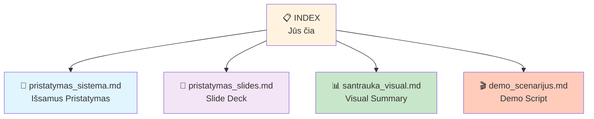
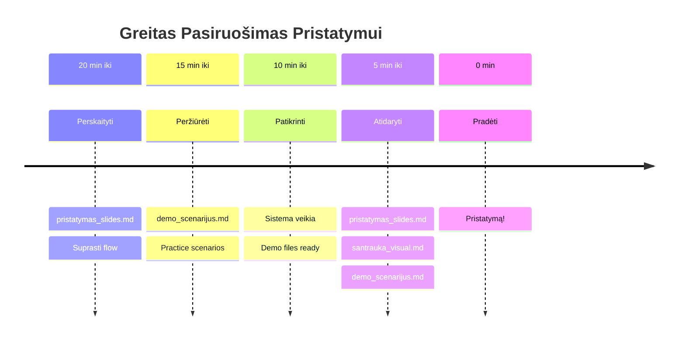

# Pristatymo Dokumentacija - Centrinė Navigacija

> Visi dokumentai, reikalingi AI Dokumentų Palyginimo Sistemos pristatymui

---

## 📚 Dokumentų Apžvalga

Šioje direktorijoje rasite **4 pagrindinius dokumentus** pristatymui:



---

## 📄 1. Išsamus Pristatymas

**Failas**: [`pristatymas_sistema.md`](file:///Users/airidas/.gemini/antigravity/brain/7738b51e-dcf9-4b37-bfd9-1592637762ba/pristatymas_sistema.md)

### Kam Skirtas?
- Pilnas sistemos apra šymas
- Technical deep dive
- Skaityti prieš pristatymą
- Reference dokumentai

### Turinys
- ✅ Sistemos apžvalga
- ✅ Detalus architektūros aprašymas (3 etapai)
- ✅ Kas veikia (complete list)
- ✅ Kas reikia patobulinti (detailed roadmap)
- ✅ Technologijos ir modeliai
- ✅ Performance metrics
- ✅ Test results summary

### Kada Naudoti?
- **Prieš pristatymą**: Perskaityti visk ą
- **Q&A metu**: Quick reference
- **Po pristatymo**: Pasidalinti su klausėjais

**Ilgis**: ~15 puslapių  
**Trukmė skaityti**: ~20-30 min

---

## 🎯 2. Slide Deck

**Failas**: [`pristatymas_slides.md`](file:///Users/airidas/.gemini/antigravity/brain/7738b51e-dcf9-4b37-bfd9-1592637762ba/pristatymas_slides.md)

### Kam Skirtas?
- Pristatymo skaidrės
- PowerPoint-style struktura
- Presentation flow

### Turinys
- 🎯 Projekto tikslas
- 📐 Architektūra (vizualios diagramos)
- 1️⃣ 2️⃣ 3️⃣ Trijų etapų aprašymai
- ✅ Veikiantys komponentai
- 🚧 Tobulinimo sritys
- 📊 Rezultatai
- 🎓 Išmoktos pamokos
- 🚀 Ateities planai

### Ypatumai
- Aiškus slide struktura (---)
- Mermaid diagramos
- Carousel examples
- Tables ir statistics
- Emoji indicators

### Kada Naudoti?
- **Pristatymo metu**: Kaip slides
- **Share screen**: Scroll per skaidr es
- **Post-presentation**: Siųsti auditori jai

**Ilgis**: ~25 "slides"  
**Trukmė pristatyti**: ~15-20 min

---

## 📊 3. Visual Summary

**Failas**: [`santrauka_visual.md`](file:///Users/airidas/.gemini/antigravity/brain/7738b51e-dcf9-4b37-bfd9-1592637762ba/santrauka_visual.md)

### Kam Skirtas?
- Greita vizuali apžvalga
- One-page reference
- Quick facts

### Turinys
- 🔄 System flow diagram
- 🗺️ Component map (mindmap)
- 💻 Tech stack visualization
- 📊 Performance dashboard
- 📅 Implementation gantt chart
- 🎯 Roadmap timeline
- ⚖️ Strengths vs Weaknesses
- 📈 Quick stats table

### Ypatumai
- **Mermaid heavy**: Visos diagramos
- **Visual first**: Mažai teksto
- **One page**: Visa info greita i

### Kada Naudoti?
- **Pristatymo pradžia**: System overview
- **Quick reference**: Prieš Q&A
- **Poster-style**: Atspausdinti/share

**Ilgis**: 1 puslapis (su diagramomis)  
**Trukmė peržiūrėti**: ~2-3 min

---

## 🎬 4. Demo Scenarijus

**Failas**: [`demo_scenarijus.md`](file:///Users/airidas/.gemini/antigravity/brain/7738b51e-dcf9-4b37-bfd9-1592637762ba/demo_scenarijus.md)

### Kam Skirtas?
- Step-by-step demo instrukcijos
- Q&A preparation
- Troubleshooting guide

### Turinys
- 📋 Pre-demo checklist
- 🎬 3 Demo scenarijai:
  1. Skaitmeninis PDF palyginimas
  2. Skenuotas PDF su OCR
  3. Advanced features
- 💬 60+ galimų klausimų & atsakymų
- 🐛 Troubleshooting tips
- 🎯 Demo best practices
- ⏱️ 15-min timeline

### Ypatumai
- **Practical**: Konkretūs žingsniai
- **Scripts**: Ką pasakyti kiekviename žingsnyje
- **Q&A**: Technin iai ir demo klausimai
- **Backup plans**: Kas daryti jei fail

### Kada Naudoti?
- **Prieš demo**: Išmokti scripts
- **Demo metu**: Keep open kaip cheat sheet
- **Q&A**: Quick answers

**Ilgis**: ~20 puslapių  
**Trukmė pasiruošti**: ~30-45 min

---

## 🚀 Quick Start Guide

### Pristatymui Už 30 Minučių



### Optimal Workflow

1. **Dieną Prieš**
   - [ ] Perskaityti [`pristatymas_sistema.md`](file:///Users/airidas/.gemini/antigravity/brain/7738b51e-dcf9-4b37-bfd9-1592637762ba/pristatymas_sistema.md) (full understanding)
   - [ ] Išmokti [`demo_scenarijus.md`](file:///Users/airidas/.gemini/antigravity/brain/7738b51e-dcf9-4b37-bfd9-1592637762ba/demo_scenarijus.md) scenarios
   - [ ] Practice demo 2-3 kartus

2. **Prieš Pristatymą (30 min)**
   - [ ] Review [`pristatymas_slides.md`](file:///Users/airidas/.gemini/antigravity/brain/7738b51e-dcf9-4b37-bfd9-1592637762ba/pristatymas_slides.md)
   - [ ] Atidaryti [`santrauka_visual.md`](file:///Users/airidas/.gemini/antigravity/brain/7738b51e-dcf9-4b37-bfd9-1592637762ba/santrauka_visual.md) (reference)
   - [ ] Test run sistema

3. **Pristatymo Metu**
   - **Main screen**: [`pristatymas_slides.md`](file:///Users/airidas/.gemini/antigravity/brain/7738b51e-dcf9-4b37-bfd9-1592637762ba/pristatymas_slides.md) + Live demo
   - **Second screen/tab**: [`demo_scenarijus.md`](file:///Users/airidas/.gemini/antigravity/brain/7738b51e-dcf9-4b37-bfd9-1592637762ba/demo_scenarijus.md) (cheat sheet)
   - **Phone/tablet**: [`santrauka_visual.md`](file:///Users/airidas/.gemini/antigravity/brain/7738b51e-dcf9-4b37-bfd9-1592637762ba/santrauka_visual.md) (quick ref)

---

## 📌 Pagrindinė Informacija

### Sistema

**URL**: http://localhost:7860  
**Status**: ✅ RUNNING  
**Runtime**: 48+ minutes

### Projektas

**Pavadinimas**: AI Dokumentų Palyginimo Sistema  
**Kursas**: P170M109 Computational Intelligence and Decision Making  
**Universitetas**: KTU  
**Data**: 2025-12-09

### Dokumentai Lokacijoje

```
/Users/airidas/.gemini/antigravity/brain/7738b51e-dcf9-4b37-bfd9-1592637762ba/
├── pristatymas_sistema.md      (Išsamus pristatymas)
├── pristatymas_slides.md        (Slide deck)
├── santrauka_visual.md          (Visual summary)
└── demo_scenarijus.md           (Demo script)
```

---

## 🎯 Rekomenduojama Naudojimo Seka

### Pagal Auditorijos Tipą

#### Academic Presentation (University)
1. Start: [`pristatymas_slides.md`](file:///Users/airidas/.gemini/antigravity/brain/7738b51e-dcf9-4b37-bfd9-1592637762ba/pristatymas_slides.md) - Projekto tikslas
2. Show: [`santrauka_visual.md`](file:///Users/airidas/.gemini/antigravity/brain/7738b51e-dcf9-4b37-bfd9-1592637762ba/santrauka_visual.md) - Architektūra
3. Demo: Live demo (su [`demo_scenarijus.md`](file:///Users/airidas/.gemini/antigravity/brain/7738b51e-dcf9-4b37-bfd9-1592637762ba/demo_scenarijus.md))
4. Discuss: [`pristatymas_slides.md`](file:///Users/airidas/.gemini/antigravity/brain/7738b51e-dcf9-4b37-bfd9-1592637762ba/pristatymas_slides.md) - Results & Future Work
5. Q&A: [`pristatymas_sistema.md`](file:///Users/airidas/.gemini/antigravity/brain/7738b51e-dcf9-4b37-bfd9-1592637762ba/pristatymas_sistema.md) kaip reference

#### Technical Deep Dive
1. Start: [`santrauka_visual.md`](file:///Users/airidas/.gemini/antigravity/brain/7738b51e-dcf9-4b37-bfd9-1592637762ba/santrauka_visual.md) - System overview
2. Deep dive: [`pristatymas_sistema.md`](file:///Users/airidas/.gemini/antigravity/brain/7738b51e-dcf9-4b37-bfd9-1592637762ba/pristatymas_sistema.md) - Architecture
3. Demo: Technical demo scenarios
4. Code: Show actual code from project

#### Quick Demo (10 min)
1. Open: [`santrauka_visual.md`](file:///Users/airidas/.gemini/antigravity/brain/7738b51e-dcf9-4b37-bfd9-1592637762ba/santrauka_visual.md) - 2 min overview
2. Demo: Scenario 1 from [`demo_scenarijus.md`](file:///Users/airidas/.gemini/antigravity/brain/7738b51e-dcf9-4b37-bfd9-1592637762ba/demo_scenarijus.md) - 5 min
3. Q&A: Quick answers - 3 min

---

## 📚 Papildoma Dokumentacija

### Projekto Dokumentai

| Dokumentas | Paskirtis | Lokacija |
|-----------|----------|----------|
| **README.md** | Setup guide | [Link](file:///Users/airidas/Documents/KTU/P170M109%20Computational%20Intelligence%20and%20Decision%20Making/project/README.md) |
| **TEST_RESULTS.md** | Testing results | [Link](file:///Users/airidas/Documents/KTU/P170M109%20Computational%20Intelligence%20and%20Decision%20Making/project/TEST_RESULTS.md) |
| **models/README.md** | Model docs | [Link](file:///Users/airidas/Documents/KTU/P170M109%20Computational%20Intelligence%20and%20Decision%20Making/project/models/README.md) |
| **.env.example** | Configuration | Project root |

### Kodo Failai

| Failas | Aprašymas | LOC |
|--------|-----------|-----|
| **app.py** | Entry point | 46 |
| **gradio_ui.py** | Main UI | ~2000 |
| **ocr_router.py** | OCR routing | ~600 |
| **text_comparison.py** | Semantic comparison | ~350 |
| **deepseek_ocr_engine.py** | DeepSeek OCR | ~820 |

---

## ✅ Pre-Presentation Checklist

### Technical Setup
- [ ] Sistema veikia: http://localhost:7860
- [ ] Visi modeliai užkrauti (~620MB)
- [ ] Demo PDF failai paruošti
- [ ] Browser clean, tabs organized

### Dokumentai
- [ ] [`pristatymas_slides.md`](file:///Users/airidas/.gemini/antigravity/brain/7738b51e-dcf9-4b37-bfd9-1592637762ba/pristatymas_slides.md) atidarytas
- [ ] [`demo_scenarijus.md`](file:///Users/airidas/.gemini/antigravity/brain/7738b51e-dcf9-4b37-bfd9-1592637762ba/demo_scenarijus.md) atidarytas
- [ ] [`santrauka_visual.md`](file:///Users/airidas/.gemini/antigravity/brain/7738b51e-dcf9-4b37-bfd9-1592637762ba/santrauka_visual.md) accessible
- [ ] This INDEX open (navigation)

### Knowledge
- [ ] Perskaitytas [`pristatymas_sistema.md`](file:///Users/airidas/.gemini/antigravity/brain/7738b51e-dcf9-4b37-bfd9-1592637762ba/pristatymas_sistema.md)
- [ ] Išmokti demo scenarios
- [ ] Practice run completed
- [ ] Q&A answers reviewed

### Backup Plan
- [ ] Screenshots paruošti (jei sistema fail)
- [ ] Atsarginiai PDF failai
- [ ] Alternative demo ready

---

## 💡 Tips & Tricks

### Presentation Flow

**Optimal 15-min Presentation**:
```
00:00-02:00  Intro (pristatymas_slides.md: slides 1-3)
02:00-05:00  Architecture (santrauka_visual.md)
05:00-10:00  Live Demo (demo_scenarijus.md: Scenario 1+2)
10:00-13:00  Results & Future (pristatymas_slides.md: slides 20-25)
13:00-15:00  Q&A (pristatymas_sistema.md as reference)
```

### Screen Setup (Dual Monitor)

**Primary Screen** (audience sees):
- Presentation documents
- Live demo (Gradio UI)

**Secondary Screen** (only you see):
- [`demo_scenarijus.md`](file:///Users/airidas/.gemini/antigravity/brain/7738b51e-dcf9-4b37-bfd9-1592637762ba/demo_scenarijus.md) - Demo script
- Timer
- Notes

### Navigation Shortcuts

**Quick Jump**:
- Overview → [`santrauka_visual.md`](file:///Users/airidas/.gemini/antigravity/brain/7738b51e-dcf9-4b37-bfd9-1592637762ba/santrauka_visual.md)
- Details → [`pristatymas_sistema.md`](file:///Users/airidas/.gemini/antigravity/brain/7738b51e-dcf9-4b37-bfd9-1592637762ba/pristatymas_sistema.md)
- Slides → [`pristatymas_slides.md`](file:///Users/airidas/.gemini/antigravity/brain/7738b51e-dcf9-4b37-bfd9-1592637762ba/pristatymas_slides.md)
- Demo → [`demo_scenarijus.md`](file:///Users/airidas/.gemini/antigravity/brain/7738b51e-dcf9-4b37-bfd9-1592637762ba/demo_scenarijus.md)

---

## 🎓 Conclusion

Turite **pilną pristatymo paketą**:

- ✅ Išsamų techninį dokumentą
- ✅ Presentation slides
- ✅ Visual reference
- ✅ Detailed demo script
- ✅ Q&A preparation

**Sistema veikia ir ready demonstracijai!** 🚀

---

## 📞 Quick Links

**Dokumentacijos Failai**:
- 📄 [Išsamus Pristatymas](file:///Users/airidas/.gemini/antigravity/brain/7738b51e-dcf9-4b37-bfd9-1592637762ba/pristatymas_sistema.md)
- 🎯 [Slide Deck](file:///Users/airidas/.gemini/antigravity/brain/7738b51e-dcf9-4b37-bfd9-1592637762ba/pristatymas_slides.md)
- 📊 [Visual Summary](file:///Users/airidas/.gemini/antigravity/brain/7738b51e-dcf9-4b37-bfd9-1592637762ba/santrauka_visual.md)
- 🎬 [Demo Script](file:///Users/airidas/.gemini/antigravity/brain/7738b51e-dcf9-4b37-bfd9-1592637762ba/demo_scenarijus.md)

**Projekto Dokumentai**:
- 📘 [README.md](file:///Users/airidas/Documents/KTU/P170M109%20Computational%20Intelligence%20and%20Decision%20Making/project/README.md)
- 📗 [models/README.md](file:///Users/airidas/Documents/KTU/P170M109%20Computational%20Intelligence%20and%20Decision%20Making/project/models/README.md)
- 📙 [TEST_RESULTS.md](file:///Users/airidas/Documents/KTU/P170M109%20Computational%20Intelligence%20and%20Decision%20Making/project/TEST_RESULTS.md)

**Sistema**: http://localhost:7860

---

**Sėkmės su Pristatymu! 🎉**
