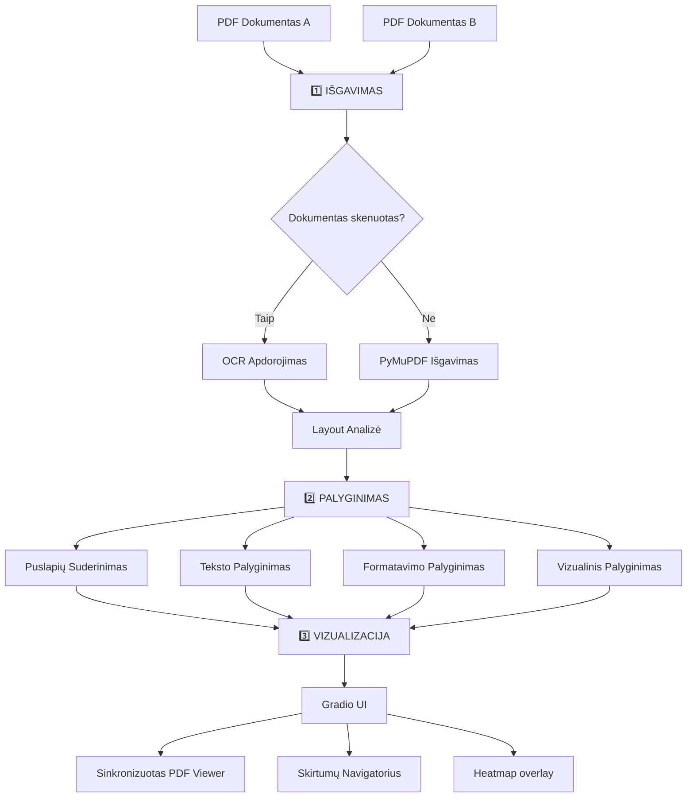

# AI Dokumentų Palyginimo Sistema - Pristatymas

## 📋 Turinys

1. [Sistemos Apžvalga](#sistemos-apžvalga)
2. [Kaip Sistema Veikia](#kaip-sistema-veikia)
3. [Kas Veikia](#kas-veikia)
4. [Kas Dar Reikia Patobulinti](#kas-dar-reikia-patobulinti)
5. [Technologijos ir Modeliai](#technologijos-ir-modeliai)

---

## 🎯 Sistemos Apžvalga

### Paskirtis
AI Dokumentų Palyginimo Sistema yra **local**. Sistema skirta palyginti du PDF dokumentus, skenuotus arba skaitmeninius.

### Pagrindiniai Tikslai
- ✅ **Privatumas**: visa apdorojimo logika vykdoma kompiuteryje
- ✅ **Tikslumas**: nustatyti turinio, formatavimo ir skirtumus
- ✅ **Našumas**: apdoroti iki 60 puslapių per <3s/puslapį
- ✅ **Interaktyvumas**: Gradio sąsaja

---

## ⚙️ Kaip Sistema Veikia

### Architektūra - 3 Pagrindiniai Etapai



### 1️⃣ Extraction

#### Skaitmeniams PDF
- **PyMuPDF (fitz)**: išgauna tekstą, šriftus, spalvas, pozicijas
> [!NOTE]
> Net skenuotų PDF atveju PyMuPDF naudojamas puslapius „renderinti“ į vaizdą (pixmap) OCR varikliams.


#### Skenuotiems PDF
**Automatinė OCR Variklio Pasirinkimas**:

```python
# Automatinė Priority Eilė:
1. PaddleOCR (CPU/Mac) - default pasirinkimas atsiskaitymui/CI
2. Tesseract (atsarginis) - fallback, jei Paddle nepasiekiamas
3. DeepSeek-OCR (optional) - įjungiamas tik kai reikia ir kai galima (pvz. `RUN_DEEPSEEK_OCR=1`)
```

**OCR Funkcionalumas**:
- Automatinis teksto atpažinimas iš paveikslėlių
- Bounding box'ų nustatymas kiekvienam teksto blokui
- Struktūros metaduomenų išgavimas (antraštės, lentelės, sąrašai)

#### Layout Analizė
**DocLayout-YOLO** modelis aptinka:
- `title` - Dokumentų antraštės
- `plain text` - Įprasti teksto paragrafai
- `figure` - Paveikslėliai ir diagramos
- `table` - Lentelės
- `formula` - Matematinės formulės
- Ir daugiau (iš viso 10 klasių)

**Našumas**: N/A šiame etape (DocLayout-YOLO atskiras latency nebuvo raportuotas artefaktuose; pagal 9.4.4 tikėtina, kad layout gali būti bottleneck CPU režime)

#### Antraštės/Poraštės Aptikimas
- Aptinka pasikartojančius elementus dokumento viršuje/apačioje
- Filtruoja juos iš palyginimo, kad sumažintų triukšmą

---

### 2️⃣ Palyginimo Etapas (Comparison)

#### A. Puslapių Suderinimas
```python
# Algoritmas:
1. Skaičiuoja puslapių panašumus (embedding'ai)
2. Nustato geriausią suderinimą tarp dokumentų
3. Aptinka pridėtus/pašalintus puslapius
4. Aptinka layout pokyčius
```

#### B. Teksto Palyginimas
**Sentence Transformer (all-MiniLM-L6-v2)**:
- Generuoja 384-dimensinius embedding'us kiekvienam tekstui
- Skaičiuoja kosinuso panašumą (cosine similarity)
- Threshold: 0.82 (konfigūruojama)

**Aptinka**:
- ✏️ Turinio pakeitimus
- ➕ Pridėjimus
- ➖ Pašalinimus
- 🔄 Semantinius pokyčius

**Character-level diff**:
- Tikslus simbolių lygmens palyginimas
- Paryškina konkrečius pakeitimus tame pačiame sakinyje

#### C. Formatavimo Palyginimas
Lygina:
- 🔤 **Šriftą** (font family, size)
- **B** **Stilių** (bold, italic, underline)
- 🎨 **Spalvą** (RGB skirtumai)
- 📏 **Tarpus** (line height, margins)

#### D. Lentelių Palyginimas
- Išgauna lentelių struktūrą
- Lygina ląsteles (cell-by-cell)
- Aptinka pridėtas/pašalintas eilutes/stulpelius

#### E. Vizualinis Palyginimas
- Pixel-level palyginimas
- Generuoja heatmap'us su skirtumų dengimais
- DPI: 150 (konfigūruojama)

---

### 3️⃣ Vizualizacijos Etapas (Visualization)

#### Gradio UI Komponentai

**1. Failų Įkėlimas**
- Drag-and-drop palaikymas
- Automatinis PDF validavimas

**2. Parametrų Pasirinkimas**
```
📊 Jautrumo Threshold (0.70 - 0.95)
🔍 Scanned Document Mode (abi PDF laikomos skenuotomis; prioritetas OCR)
⚡ OCR Enhancement (Hybrid, safe for digital PDFs) (native + OCR su saugikliu; neperrašo native teksto)
🎨 Heatmap overlay (vizualiniai skirtumai)
```

**3. Rezultatų Rodymas**

**Gallery View** (numatytasis):
- Side-by-side PDF puslapių peržiūra
- Scroll sync tarp puslapių
- Diff highlight'ai ant puslapių

**Synchronized Viewer**:
- Premium PDF viewer su sinchronizuota navigacija
- Real-time page jumping
- Smooth scrolling

**4. Diff Navigator**
```
📋 Skirtumų Sąrašas:
  ├─ Content Changes (turinys)
  ├─ Formatting Changes (formatavimas)
  ├─ Layout Changes (išdėstymas)
  └─ Visual Changes (vizuali)
  
🔍 Filtrai:
  ☑️ Show Content
  ☑️ Show Formatting
  ☑️ Show Layout
  ☑️ Show Visual
  
⏮️ ⏭️ Previous/Next Navigation
```

**5. Eksportas**
- 📄 JSON formatas (mašinai skaitomas)
- 📑 PDF ataskaita (žmogui skaitomas)

---

## ✅ Kas Veikia

### 🎉 Pilnai Funkcionuojantys Komponentai

#### 1. Modelių Integracija
> [!NOTE]
> Visi modeliai veikia lokaliai, užtikrinant privatumą

| Modelis | Statusas | Paskirtis | Dydis |
|---------|----------|-----------|-------|
| **DeepSeek-OCR** | ⚠️ Optional | OCR skenuotiems PDF (GPU; išjungtas pagal nutylėjimą) | ~500MB |
| **Sentence Transformer** | ✅ Veikia | Teksto palyginimas | ~80MB |
| **DocLayout-YOLO** | ✅ Veikia | Layout aptikimas | ~39MB |
| **PaddleOCR** | ✅ Veikia | Default OCR (CPU/Mac; atsiskaitymui/CI) | Auto-download |
| **Tesseract** | ✅ Veikia | Fallback OCR (atsarginis) | Sistema |

#### 2. Išgavimo Moduliai
- ✅ PyMuPDF Parser (skaitmeniniai PDF)
- ⚠️ DeepSeek-OCR Engine (optional; `RUN_DEEPSEEK_OCR=1`)
- ✅ PaddleOCR Engine (CPU/Mac) 
- ✅ Tesseract OCR Engine (atsarginis)
- ✅ OCR Router (automatinis variklio pasirinkimas)
- ✅ Layout Analyzer (DocLayout-YOLO)
- ✅ Header/Footer Detector
- ✅ OCR Warmup (background loading)

#### 3. Palyginimo Moduliai
- ✅ Text Comparator (Sentence Transformer)
- ✅ Formatting Comparator
- ✅ Table Comparator (cell-by-cell)
- ✅ Figure Comparator
- ✅ Visual Diff Generator
- ✅ Page Alignment
- ✅ Section Alignment
- ✅ Hierarchical Alignment
- ✅ Diff Classifier
- ✅ Character-level diff

#### 4. Vizualizacija
- ✅ Gradio UI (v6.0.2)
- ✅ PDF Gallery Viewer
- ✅ Synchronized PDF Viewer
- ✅ Diff Navigator
- ✅ Heatmap overlay
- ✅ Bounding Box Visualization
- ✅ Page Navigation (Prev/Next)
- ✅ Diff Filtering
- ✅ Export JSON/PDF

#### 5. Optimizacijos
- ✅ Model Caching (greitas pakartotinis paleidimas)
- ✅ Background OCR Warmup
- ✅ Batch Similarity Computation
- ✅ Module-level OCR Instance Caching
- ✅ Configurable DPI/Performance Settings

#### 6. Testavimas
> [!IMPORTANT]
> Faktiniai rezultatai (2026-01-04): **487 passed**, **17 skipped**, **0 failed**; coverage (comparison+extraction) **80%**; golden **P/R/F1 = 0.9714 / 0.8848 / 0.9227**; latency **p95 1.9355 s/page**.
>
> Pastaba: **Formatting F1 = 0.75** – pasiekia minimalų slenkstį, bet neatitinka tikslo **0.80** (DoD „MIN ONLY“).

- ✅ `pytest` unit + integration testai
- ✅ Golden evaluation (10 variacijų)
- ⚠️ Praleisti testai: DeepSeek (pagal dizainą), dalis OCR/doclayout testų (reikia papildomų testinių PDF)

### 📌 Kas veikia / kas neveikia pagal metrikas (iš `TESTING_PLAN.md`, 2026-01-04)

#### Techninė pusė

**Kas veikia (artifact-backed)**:
- ✅ **Skaitmeninių PDF (PyMuPDF) kelias**: kokybė gera (golden F1 **0.9227**; precision **0.9714**; recall **0.8848**) ir našumas atitinka tikslą (golden latency **p95 1.9355 s/page** < 3s).
- ✅ **Teksto pakeitimų aptikimas**: content kategorija yra stipri (F1 ~0.95 pagal change-type suvestinę).
- ✅ **Bazinė stabilumo kokybė**: `pytest` pilnas suitas **487 passed / 0 failed**; coverage (comparison+extraction) **80%**.

**Kas neveikia / nepilnai (ir kodėl)**:
- ❌ **Formatavimo kokybė**: golden formatting F1 **0.75 < 0.80 (MUST)** → heuristikos/tolerancijos dar per silpnos arba trūksta formatting test atvejų įvairovės.
- ❌ **Skenuotų dokumentų našumas (R4)**: end-to-end šiame etape nepasiekia tikslo (Tesseract ~**5.96 s/page**, Paddle ~**28.43 s/page**, imtis: **1 pora**) → didelis pipeline overhead (OCR + layout + diff), tikėtinas bottleneck layout/CPU.
- ⚠️ **Skenuotų dokumentų FP rizika (R1)**: precision žemas (ypač Paddle ~**0.4286**) → OCR triukšmas generuoja netikrus skirtumus; reikia kalibruoti `ocr_gating.py` slenksčius didesnėje imtyje.
- N/A **IoU / Alignment accuracy**: šiems DoD kriterijams šiame etape nėra artefaktų/GT, todėl objektyviai nepatikrinta.

#### UI pusė

**Kas veikia**:
- ✅ Pagrindiniai scenarijai (įkėlimas → palyginimas → diffs sąrašas → vizualizacijos) yra „demo-ready“ skaitmeniniams PDF, nes latency ir F1 (content) pakankami sklandžiai interakcijai.
- ✅ Difų naršymas (prev/next, filtrai) yra praktiškai naudojamas, nes sistemos išvestis stabiliai generuojama (0 testų fail, 0 crash full suite).

**Kas neveikia / kada UI tampa nepatogi**:
- ❌ Skenuotuose dokumentuose UI tampa mažiau responsive, nes end-to-end laikas viršija 3s/page (ypač Paddle), todėl vartotojas laukia ilgai be aiškaus progreso.
- ⚠️ Formatavimo difų patikimumas ribotas (formatting F1 < 0.80), todėl UI gali rodyti dalį formatavimo pakeitimų netiksliai arba nepilnai.

**Trumpai – ką daryti toliau**:
- Pirmas prioritetas: profiling + layout/OCR optimizacijos (žr. `TESTING_PLAN.md` 9.4.4), kad scanned kelias priartėtų prie <3s/page.
- Antras prioritetas: formatavimo heuristikų kalibravimas ir papildomi formatting test atvejai, kad F1 ≥ 0.80.

**Testavimo planas**: [`docs/TESTING_PLAN.md`](../TESTING_PLAN.md)  
**Testavimo ataskaita**: [`docs/TEST_REPORT_2026-01-04.md`](../TEST_REPORT_2026-01-04.md)

---

## 🚧 Kas Dar Reikia Patobulinti

### 1. Našumo Optimizacijos

> [!WARNING]
> OCR apdorojimas gali būti lėtas dideliems dokumentams

#### A. DeepSeek-OCR Optimizacija
**Dabartinė Problema**:
- Pilnų dokumentų OCR apdorojimas gali užtrukti
- DPI nustatymai įtakoja greitį ir tikslumą

**Galimi Sprendimai**:
- [ ] Optimizuoti PDF rendering DPI
- [ ] Implementuoti paralelų puslapių apdorojimą
- [ ] Pridėti progress bar'ą ilgiems procesams
- [ ] Cache OCR rezultatus (išvengti pakartotinio apdorojimo)

#### B. UI Responsiveness
**Dabartinė Problema**:
- Galimas UI "užšalimas" vykdant ilgus OCR procesus

**Galimi Sprendimai**:
- [ ] Async processing su progress updates
- [ ] WebSocket komunikacija real-time feedback
- [ ] Chunk-based PDF processing (po kelias psl.)

### 2. Funkcionalumo Išplėtimai

#### A. Lentelių Palyginimas (Advanced)
**Kas Yra**:
- ✅ Bazinis cell-by-cell palyginimas

**Kas Trūksta**:
- [ ] Table Transformer modelio integracija
- [ ] Automatinis lentelių struktūros išgavimas OCR dokumentams
- [ ] Vizualinis lentelių diff rodymas UI

#### B. Paveikslėlių Palyginimas
**Kas Yra**:
- ✅ Caption palyginimas
- ✅ Bounding box aptikimas

**Kas Trūksta**:
- [ ] Image similarity metrics (perceptual hashing)
- [ ] Vizualinis paveikslėlių diff
- [ ] Chart/graph specific comparison

#### C. Matematinių Formulių Palyginimas
**Kas Trūksta**:
- [ ] LaTeX extraction iš formulių
- [ ] Semantinis formulių palyginimas
- [ ] Formula rendering diff

### 3. UI/UX Patobulinimai

#### A. Synchronized Viewer
**Kas Veikia**:
- ✅ Bazinis sync viewer
- ✅ Page navigation

**Kas Galėtų Būti Geriau**:
- [ ] Smoother scrolling sync
- [ ] Zoom synchronization
- [ ] Highlight diff regions on click
- [ ] Minimize PDF loading states

#### B. Diff Navigator
**Kas Galėtų Būti Geriau**:
- [ ] Diff kategorijų statistika (kiekvienos rūšies diff skaičius)
- [ ] Confidence score visualization (grafikai)
- [ ] Diff grouping pagal puslapius
- [ ] Search per diff aprašymus

#### C. Export Features
**Kas Yra**:
- ✅ JSON export
- ✅ PDF export (bazinis)

**Kas Galėtų Būti Geriau**:
- [ ] HTML export su interaktyvumu
- [ ] Excel export lentelių diff
- [ ] Customizable PDF report templates
- [ ] Diff summary statistics

### 4. Testavimas ir Validacija

#### A. Realių Dokumentų Testavimas
**Kas Trūksta**:
- [ ] Large-scale testing su įvairiais dokumentais
- [ ] Performance benchmarking (įvairiems dokumentų tipams)
- [ ] Edge case handling (corrupt PDFs, very large PDFs)

#### B. Accuracy Metrics
**Kas Trūksta**:
- [ ] Ground truth dataset sukūrimas
- [ ] Precision/Recall metrikų skaičiavimas
- [ ] A/B testing skirtingų threshold'ų

#### C. Unit Testing
**Kas Yra**:
- ✅ Integration tests
- ✅ Module tests

**Kas Galėtų Būti Geriau**:
- [ ] Pytest unit tests kiekvienam moduliui
- [ ] Mock testing modelių
- [ ] CI/CD pipeline setup

### 5. Dokumentacija

**Kas Yra**:
- ✅ README.md
- ✅ models/README.md
- ✅ docs/TESTING_PLAN.md
- ✅ docs/TEST_REPORT_2026-01-04.md
- ✅ .env.example
**Kas Galėtų Būti Geriau**:
- [ ] API Documentation (docstrings → Sphinx)
- [ ] User Guide (kaip naudoti sistemą)
- [ ] Developer Guide (kaip plėsti sistemą)
- [ ] Video tutorials/demos

### 6. Deployment

**Dabartinis Statusas**:
- ✅ Lokalus paleidimas (`python app.py`)

**Kas Galėtų Būti Geriau**:
- [ ] Docker containerization
- [ ] Docker Compose setup su visais dependencies
- [ ] Cloud deployment guide (AWS/GCP/Azure)
- [ ] Gradio Share link (temporary demo)

---

## 🔧 Technologijos ir Modeliai

### Core Technologies

| Technologija | Versija | Paskirtis |
|--------------|---------|-----------|
| **Python** | 3.9+ | Pagrindinė kalba |
| **Gradio** | 6.0.2 | Web UI framework |
| **PyMuPDF (fitz)** | Latest | PDF manipulation |
| **PyTorch** | Latest | Deep learning backend |
| **Sentence Transformers** | Latest | NLP embeddings |
| **OpenCV** | Latest | Image processing |
| **Pillow** | Latest | Image handling |
| **NumPy** | Latest | Numerical computations |

### AI Modeliai

#### 1. DeepSeek-OCR
```yaml
Modelis: deepseek-ai/deepseek-ocr
Statusas: optional (pagal nutylėjimą išjungtas)
Dydis: ~500MB
Framework: HuggingFace Transformers
Device: CUDA (GPU)
Paskirtis: High-accuracy OCR su grounding
Įjungimas: RUN_DEEPSEEK_OCR=1
Features:
  - Markdown output su bounding boxes
  - Multi-language support
  - Structure recognition
```

#### 2. Sentence Transformer
```yaml
Modelis: sentence-transformers/all-MiniLM-L6-v2
Local path (cache): models/all-MiniLM-L6-v2
Dydis: ~80MB
Framework: Sentence Transformers
Device: CPU/GPU
Paskirtis: Semantic text similarity
Naudojimas kode: comparison/ocr_gating.py (embeddings + gating), puslapių/tekstų suderinimas
Features:
  - 384-dimensional embeddings
  - Cosine similarity computation
  - Fast batch processing
```

#### 3. DocLayout-YOLO
```yaml
Modelis: juliozhao/DocLayout-YOLO-DocStructBench
Local file: models/doclayout_yolo_docstructbench_imgsz1024.pt
Dydis: ~39MB
Framework: Ultralytics YOLO
Device: CPU/GPU
Paskirtis: Document layout analysis
Naudojimas kode: extraction/layout_analyzer.py (layout regionų detekcija ir klasifikacija)
Features:
  - 10 document element classes
  - N/A (atskiras DocLayout-YOLO inference laikas šiame etape nematuotas; tikėtina, kad tai viena iš „bottleneck“ vietų CPU režime)
  - Optimized for PDFs
```

#### 4. PaddleOCR
```yaml
Modelis: PaddlePaddle/PaddleOCR v3.x
Dydis: Auto-download
Framework: PaddlePaddle
Device: CPU/Mac M-series
Paskirtis: Fast OCR for non-GPU systems
Features:
  - Multi-language support
  - Text orientation detection
  - Document orientation classification
```

#### 5. Tesseract OCR
```yaml
Engine: Tesseract 5.x
Framework: pytesseract wrapper
Device: CPU
Paskirtis: Fallback OCR engine
Features:
  - Universal language support
  - System-level installation
  - Reliable baseline
```

### Konfigūracija

Visi parametrai konfigūruojami per `.env` failą:

````bash
# Modelių keliai
DEEPSEEK_OCR_MODEL_PATH=models/deepseek-ocr
SENTENCE_TRANSFORMER_MODEL=models/all-MiniLM-L6-v2
YOLO_LAYOUT_MODEL_NAME=models/doclayout_yolo_docstructbench_imgsz1024.pt

# Optional features (pagal nutylėjimą išjungta)
RUN_DEEPSEEK_OCR=0

# Threshold'ai
TEXT_SIMILARITY_THRESHOLD=0.82
FORMATTING_CHANGE_THRESHOLD=0.1
VISUAL_DIFF_PIXEL_THRESHOLD=30

# Našumo nustatymai
MAX_PAGES=60
SECONDS_PER_PAGE_TARGET=3.0
RENDER_DPI=144
````

---

## 📊 Sistemos Statistika

### Performance Metrics (faktiniai – 2026-01-04)

| Metrika | Rezultatas | Šaltinis |
|---------|------------|----------|
| `pytest` full suite | 487 passed / 17 skipped / 0 failed (48.47s) | `docs/TEST_REPORT_2026-01-04.md` |
| Golden P/R/F1 | 0.9714 / 0.8848 / 0.9227 | `tests/golden_results.json` |
| Golden latency | avg 1.8525 s/page; p95 1.9355 s/page | `tests/golden_results.json` |
| OCR benchmark (digital) | PyMuPDF 0.005 s; Tesseract 0.876 s; Paddle 16.871 s | `benchmark/benchmark_results.json` |
| OCR benchmark (scanned) | Tesseract 1.233 s; Paddle 9.388 s | `benchmark/benchmark_results.json` |
| Coverage (comparison+extraction) | 80% | `coverage.xml` |

### Model Sizes

```
📦 Total Model Storage: ~620MB
├─ DeepSeek-OCR: ~500MB
├─ Sentence Transformer: ~80MB
└─ DocLayout-YOLO: ~39MB
```

### Test Coverage

```
pytest: 487 passed / 17 skipped / 0 failed
Coverage (comparison+extraction): 80%
Golden: P/R/F1 = 0.9714 / 0.8848 / 0.9227
Formatting F1: 0.75 (MIN ONLY; target 0.80)
```

---

## 🎯 Santrauka

### Stipriosios Pusės
1. ✅ **Pilnai vietinė** - jokių išorinių API kvietimų
2. ✅ **Modulinė architektūra** - lengva plėsti ir keisti
3. ✅ **Automatinė OCR pasirinkimas** - veikia bet kokiame hardware
4. ✅ **Interaktyvi UI** - Gradio su real-time rezultatais
5. ✅ **Išsamus testavimas** - visi komponentai patikrinti

### Tobulinimo Kryptys
1. 🚧 **Našumo optimizacijos** - greitesnis OCR apdorojimas
2. 🚧 **Advanced features** - lentelių, paveikslėlių, formulių palyginimas
3. 🚧 **UI/UX patobulinimai** - smoother interactions, better visualization
4. 🚧 **Testavimas** - daugiau realių dokumentų testų
5. 🚧 **Deployment** - Docker, cloud setup

### Veikiantis Prototipas
Sistema yra **pilnai funkcionuojantis prototipas** su visais pagrindiniais komponentais:
- ✅ OCR (3 varikliai)
- ✅ Layout Analysis
- ✅ Text/Formatting/Visual Comparison
- ✅ Interactive UI
- ✅ Export Features

**Ready for demonstration and further development! 🚀**

---

## 📚 Naudingos Nuorodos

**Projekto Failai**:
- [README.md](../../README.md)
- [docs/TESTING_PLAN.md](../TESTING_PLAN.md)
- [docs/TEST_REPORT_2026-01-04.md](../TEST_REPORT_2026-01-04.md)
- [models/README.md](../../models/README.md)

**Pagrindiniai Moduliai**:
- [app.py](../../app.py) - Entry point
- [visualization/gradio_ui.py](../../visualization/gradio_ui.py) - UI
- [extraction/ocr_router.py](../../extraction/ocr_router.py) - OCR routing
- [extraction/layout_analyzer.py](../../extraction/layout_analyzer.py) - Layout analyzer (DocLayout-YOLO)
- [comparison/ocr_gating.py](../../comparison/ocr_gating.py) - MiniLM gating/similarity
- [comparison/text_comparison.py](../../comparison/text_comparison.py) - Text comparison

---

**Sukurta**: 2025-12-09  
**Versija**: 1.0  
**Sistema veikia**: ✅ http://localhost:7860
