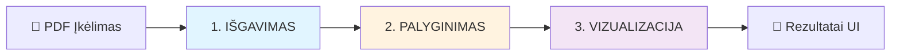
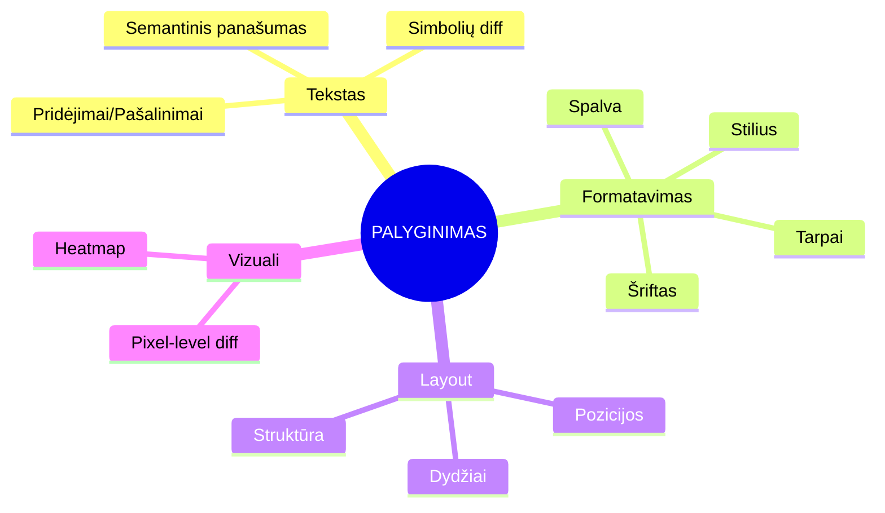
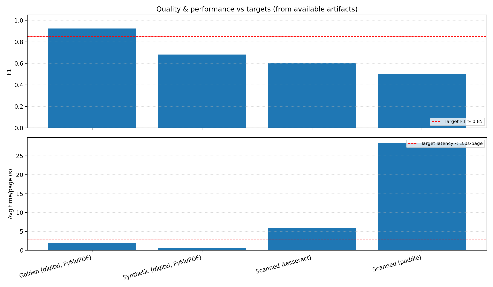
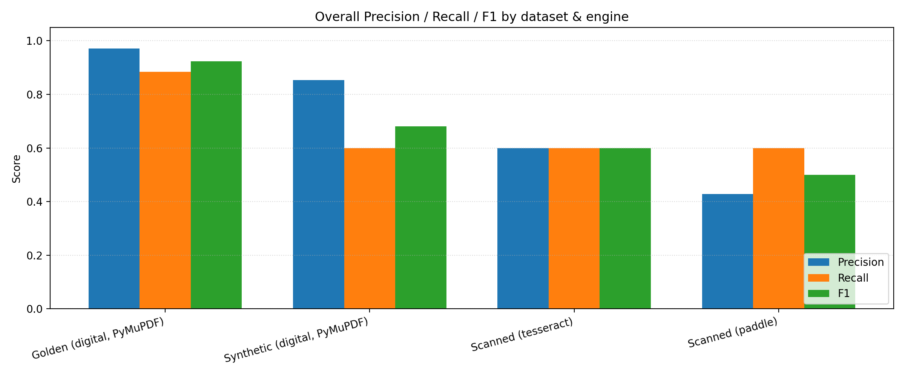
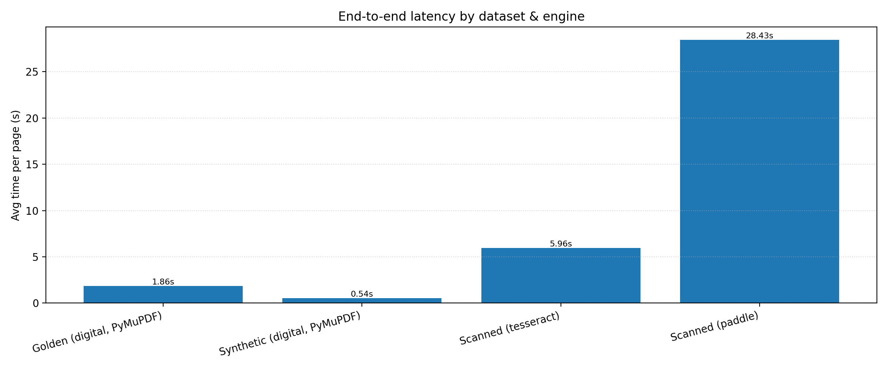
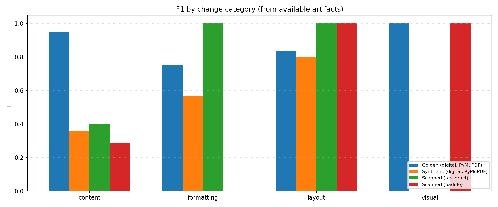
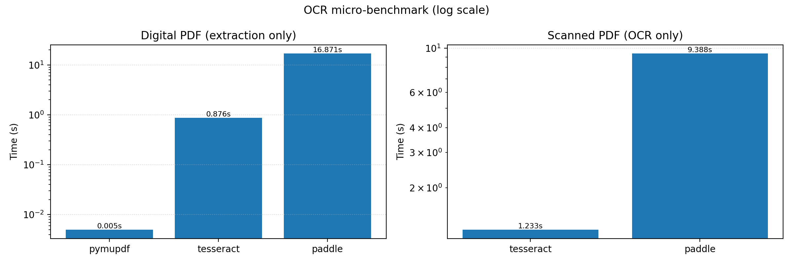

# AI Dokumentų Palyginimo Sistema
## Pristatymo Skaidrės

---

## 🎯 Projekto Tikslas

> Sukurti **vietinę AI sistemą**, kuri automatiškai palygina du PDF dokumentus ir vizualizuoja visus skirtumus

### Kodėl Svarbu?
- ✅ **Privatumas**: visi duomenys lieka vietiniame kompiuteryje
- ✅ **Automatizacija**: pakėti rankinio dokumentų lyginimo
- ✅ **Tikslumas**: AI modeliai aptinka net smulkius skirtumus
- ✅ **Interaktyvumas**: patogi sąsaja su realiu laiku veikiančiais rezultatais

---

## 📐 Sistemos Architektūra

### 3 Pagrindiniai Etapai



---

## 1️⃣ IŠGAVIMAS (Extraction)

### Kas Vyksta?

````mermaid
flowchart TD
    A[PDF Dokumentas] --> B{Skenui otas?}
    
    B -->|NE| C[PyMuPDF]
    C --> D[Tekstas + Formatavimas]
    
    B -->|TAIP| E[OCR Variklis]
   E --> G[PaddleOCR (default)]
   E --> H[Tesseract (fallback)]
   E --> F[DeepSeek-OCR (optional)]
    
    F --> I[Tekstas + Bounding Boxes]
    G --> I
    H --> I
    
    D --> J[Layout Analizė]
    I --> J
    
    J --> K[DocLayout-YOLO]
    K --> L[Struktūra: Titulai, Lentelės, Paveikslėliai]
    
    style F fill:#c8e6c9
    style G fill:#fff9c4
    style H fill:#ffccbc
    style K fill:#b3e5fc
````

### Pagrindiniai Komponentai

| Komponentas | Technologija | Paskirtis |
|------------|--------------|-----------|
| **Skaitmeniniai PDF** | PyMuPDF | Greitas teksto išgavimas |
| **OCR (default)** | PaddleOCR | Stabilus CPU sprendimas (Mac/CI) |
| **OCR (fallback)** | Tesseract | Atsarginis universalus OCR |
| **OCR (optional)** | DeepSeek-OCR | Tik kai įjungta ir prieinama (GPU) |
| **Layout** | DocLayout-YOLO | Dokumentų struktūra |

---

## 2️⃣ PALYGINIMAS (Comparison)

### Kas Lyginamos?



### AI Modeliai Darbui

**Sentence Transformer** (all-MiniLM-L6-v2)
- 384-dimensional embeddings
- Semantinis teksto palyginimas
- Threshold: 0.82

```python
# Pavyzdys
similarity = model.encode(text_a) @ model.encode(text_b).T
if similarity < 0.82:
    → SKIRTUMAS APTIKTAS! 🚨
```

---

## 3️⃣ VIZUALIZACIJA (Visualization)

### Gradio Web UI

````carousel


<!-- slide -->

### Gallery View
- Side-by-side PDF peržiūra
- Automatinis scroll sync
- Diff highlighting

<!-- slide -->

### Synchronized Viewer
- Premium PDF viewer
- Real-time navigacija
- Page jumping

<!-- slide -->

### Diff Navigator
```
📋 85 skirtumai rasti:
  ├─ 42 Content Changes
  ├─ 23 Formatting Changes
  ├─ 15 Layout Changes
  └─ 5 Visual Changes
  
⏮️ Previous | Next ⏭️
```
````

> [!NOTE]
> UI paveikslėliai yra iliustracijos - tikroje sistemoje matysite gyvą interface

---

## ✅ KAS VEIKIA

### Pilnai Implementuoti Komponentai

#### 🤖 AI Modeliai
- ⚠️ DeepSeek-OCR (~500MB; optional / requires GPU)
- ✅ Sentence Transformer (~80MB)
- ✅ DocLayout-YOLO (~39MB)
- ✅ PaddleOCR (auto-download)
- ✅ Tesseract (system)

#### 🔧 Funkcionalumas
- ✅ Automatinis OCR variklio pasirinkimas
- ✅ Teksto, formatavimo, layout palyginimas
- ✅ Vizualiniai heatmap'ai
- ✅ Interaktyvi Gradio UI
- ✅ JSON/PDF eksportas
- ✅ Bounding box vizualizacija
- ✅ Real-time diff navigacija

#### ⚡ Optimizacijos
- ✅ Model caching
- ✅ Background OCR warmup
- ✅ Batch similarity computation

---

## 🚧 KAS DAR REIKIA PATOBULINTI

### 1. Našumo Optimizacijos

> [!WARNING]
> OCR processing gali būti lėtas dideliems failams

**Prioritetas: AUKŠTAS**

- [ ] Paralelus puslapių apdorojimas
- [ ] Progress bar ilgiems procesams
- [ ] OCR rezultatų caching
- [ ] Optimizuoti DPI nustatymus

**Tikėtinas pagerėjimas**: 2-3x greičiau

---

### 2. Advanced Features

**Prioritetas: VIDUTINIS**

#### Lentelės
- [ ] Table Transformer modelis
- [ ] Automatinis struktūros išgavimas
- [ ] Vizualinis diff lentelėms

#### Paveikslėliai
- [ ] Image similarity metrics
- [ ] Perceptual hashing
- [ ] Chart-specific comparison

#### Formulės
- [ ] LaTeX extraction
- [ ] Semantinis formulių lyginimas

---

### 3. UI/UX Patobulinimai

**Prioritetas: VIDUTINIS**

#### Synchronized Viewer
- [ ] Smoother scrolling sync
- [ ] Zoom synchronization
- [ ] Click-to-highlight diff regions

#### Diff Navigator
- [ ] Diff kategorijų statistika
- [ ] Confidence score vizualizacija
- [ ] Search funkcionalumas

#### Export
- [ ] HTML export (interaktyvus)
- [ ] Excel export (lentelės)
- [ ] Customizable PDF templates

---

### 4. Testavimas & Deployment

**Prioritetas: AUKŠTAS**

#### Testavimas
- [ ] Large-scale testing su realiais dokumentais
- [ ] Performance benchmarking
- [ ] Ground truth dataset
- [ ] Pytest unit tests
- [ ] CI/CD pipeline

#### Deployment
- [ ] Docker containerization
- [ ] Docker Compose setup
- [ ] Cloud deployment guide
- [ ] Kubernetes config

---

## 📊 Rezultatai & Statistika

### Test Results (2026-01-04)

- `pytest`: **487 passed**, **17 skipped**, **0 failed** (48.47s)
- Coverage (comparison+extraction): **80%**; `comparison/hierarchical_alignment.py`: **82%**
- Golden: **Precision 0.9714**, **Recall 0.8848**, **F1 0.9227**
- Latency (golden): **avg 1.8525 s/page**, **p95 1.9355 s/page**
- Category F1: Content 0.95; Layout 0.8333; Visual 1.0; **Formatting 0.75 (MIN ONLY; target 0.80)**

### OCR Benchmark (engine palyginimas)

- Digital PDF: PyMuPDF 0.005 s; Tesseract 0.876 s; Paddle 16.871 s
- Scanned PDF: Tesseract 1.233 s; Paddle 9.388 s

---

## 📈 Metrikų vizualizacijos (iš `TESTING_PLAN.md`)



---

## 📉 Kokybė: Precision / Recall / F1



---

## ⏱️ Našumas: end-to-end latency



---

## 🧩 F1 pagal pakeitimų tipą



---

## 🔬 OCR micro-benchmark (OCR-only)



---

## ✅ Kas veikia / kas neveikia (pagal metrikas)

### Kas veikia
- ✅ Digital (PyMuPDF) pipeline: golden F1 **0.9227**, latency **p95 1.9355 s/page**
- ✅ Stabilumas: `pytest` **487 passed / 0 failed**, coverage **80%**

### Kas neveikia / ribota
- ❌ Formatting kokybė: F1 **0.75 < 0.80 (MUST)**
- ❌ Scanned performance: end-to-end > 3s/page (Tesseract ~5.96; Paddle ~28.43; imtis=1)
- ⚠️ Scanned precision žema (Paddle ~0.4286) → FP rizika

---

## 🎯 Demo

### Sistemos Demonstracija

**Sistema veikia lokaliai**: http://localhost:7860

### Galimi Demo Scenarijai

1. **Skaitmeninis PDF Palyginimas**
   - Įkelti du panašius PDF
   - Matyti turinio skirtumus
   - Formatavimo pakeitimus

2. **Skenuoto PDF su OCR**
   - Įjungti "Scanned Document Mode" (abi PDF laikomos skenuotomis; prioritetas OCR)
   - OCR automatiškai atpažįsta tekstą
   - Palygina su kitu dokumentu

3. **Diff Navigation**
   - Naršyti per skirtumų sąrašą
   - Click to jump į diff vietą
   - Filter pagal diff tipus

4. **Export**
   - Eksportuoti JSON (mašinai)
   - Eksportuoti PDF (ataskaitai)

---

## 💡 Technologijos

### Python Ecosystem

```python
# Core Stack
gradio==6.0.2          # Web UI
PyMuPDF                # PDF handling
torch                  # Deep learning
sentence-transformers  # NLP
opencv-python          # Image processing

# AI Models
deepseek-ocr           # OCR (optional)
all-MiniLM-L6-v2       # Embeddings
DocLayout-YOLO         # Layout
PaddleOCR              # OCR (default)
```

### Modulinė Architektūra

```
project/
├─ extraction/        # PDF → Data
│  ├─ ocr_router.py      (automatinis pasirinkimas)
│  ├─ deepseek_ocr_engine.py
│  ├─ paddle_ocr_engine.py
│  └─ layout_analyzer.py
│
├─ comparison/        # Data → Diffs
│  ├─ text_comparison.py
│  ├─ formatting_comparison.py
│  └─ visual_diff.py
│
└─ visualization/     # Diffs → UI
   └─ gradio_ui.py
```

---

## 🎓 Išmoktos Pamokos

### Kas Pavyko Gerai

1. ✅ **Modulinė architektūra**
   - Lengva pridėti naujus OCR variklius
   - Lengva keisti AI modelius
   - Gera separation of concerns

2. ✅ **Automatizacija**
   - OCR variklio automatic fallback
   - Model caching
   - Background warmup

3. ✅ **Testavimas**
   - Ankstyvasis testavimas padėjo rasti bug'us
   - Integration tests labai naudingi

### Iššūkiai

1. 🔥 **PaddleOCR API Changes**
   - v2 → v3 breaking changes
   - Reikėjo adaptuoti kodą

2. 🔥 **GPU/CPU Compatibility**
   - DeepSeek-OCR yra optional ir priklauso nuo GPU runtime (aplinkos/suderinamumo)
   - Default kelias atsiskaitymui/CI: PaddleOCR (CPU), su Tesseract fallback

3. 🔥 **UI Responsiveness**
   - Ilgi OCR procesai "užšaldo" UI
   - Reikia async processing

---

## 🚀 Ateities Planai

### Trumpasis Terminas (1-2 savaitės)

1. **Našumo Optimizacijos**
   - Paralelus OCR processing
   - Progress bars
   - Result caching

2. **UI Patobulinimai**
   - Diff statistics
   - Better error handling
   - Loading states

### Vidurinis Terminas (1-2 mėnesiai)

1. **Advanced Features**
   - Table Transformer
   - Image similarity
   - Formula comparison

2. **Testing**
   - Real document testing
   - Performance benchmarks
   - Accuracy metrics

### Ilgasis Terminas (6+ mėnesiai)

1. **Production Ready**
   - Docker deployment
   - Cloud scalability
   - API endpoints

2. **Enterprise Features**
   - Batch processing
   - API integration
   - Custom model training

---

## 📚 Dokumentacija

### Prieinami Dokumentai

- 📘 [README.md](../../README.md) - Setup instrukcijos
- 📗 [models/README.md](../../models/README.md) - Modelių dokumentacija
- 📙 [TESTING_PLAN.md](../TESTING_PLAN.md) - Testavimo planas
- 📙 [TEST_REPORT_2026-01-04.md](../TEST_REPORT_2026-01-04.md) - Testavimo rezultatai
- 📕 [.env.example](../../.env.example) - Konfigūracijos pavyzdys

### Kodas

- 🔗 [app.py](../../app.py) - Entry point
- 🔗 [gradio_ui.py](../../visualization/gradio_ui.py) - UI (~2000 eilučių)
- 🔗 [ocr_router.py](../../extraction/ocr_router.py) - OCR routing logika

---

## ❓ Klausimai & Atsakymai

### 1. Kodėl vietinė sistema?
> **Privatumas!** Medicininiai, teisiniai dokumentai negali būti siunčiami į cloud.

### 2. Kodėl keli OCR varikliai?
> **Compatibility!** Default režime veikia su CPU (PaddleOCR), o Tesseract yra fallback. DeepSeek-OCR yra optional ir reikalauja GPU.

### 3. Kiek greitai apdoroja?
> Golden benchmark (digital): **avg 1.85 s/page, p95 1.94 s/page**. Su OCR (scanned) bus lėčiau ir priklauso nuo pasirinkto engine.

### 4. Ar veikia su non-English dokumentais?
> **Taip!** Visi OCR varikliai palaiko multi-language.

### 5. Kiek kainuoja paleisti?
> **$0** - viskas open-source ir local. Tik hardware + elektra.

---

## 🎉 Išvados

### Projekto Statusas: **VEIKIANTIS PROTOTIPAS** ✅

#### Pasiekta
- ✅ Pilnai funkcionuojanti sistema
- ✅ Visi pagrindiniai komponentai implementuoti
- ✅ `pytest`: 487 passed / 17 skipped / 0 failed (Formatting F1: 0.75 — MIN ONLY)
- ✅ Interaktyvi UI
- ✅ Lokalus deployment

#### Tobulinimo sritys
- 🚧 Našumo optimizacijos
- 🚧 Advanced features (lentelės, formulės)
- 🚧 UI/UX patobulinimai
- 🚧 Production deployment

### Sistema yra ready demonstracijai! 🚀

---

## 🙏 Padėkos

**Naudotos Open-Source Technologijos**:
- HuggingFace Transformers
- Sentence Transformers
- Gradio
- PyMuPDF
- DeepSeek-OCR
- DocLayout-YOLO
- PaddleOCR
- Tesseract

**Akademiniai Šaltiniai**:
- DocLayout-YOLO paper (DocStructBench dataset)
- Sentence-BERT paper (semantic similarity)
- PDF parsing metodologijos

---

## 📞 Kontaktai

**Projekto Informacija**:
- **Pavadinimas**: AI Dokumentų Palyginimo Sistema
- **Kursas**: P170M109 Computational Intelligence and Decision Making
- **Universitetas**: KTU
- **Data**: 2025-12-09

**Sistema veikia**: http://localhost:7860

---

# AČIŪ UŽ DĖMESĮ! 🎓

## Klausimų? 💬
