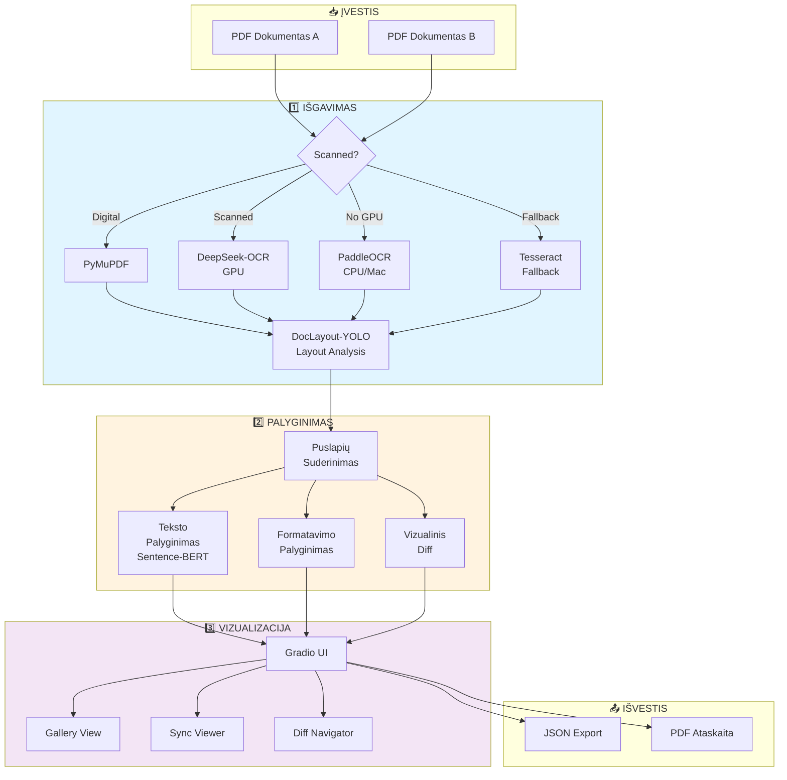
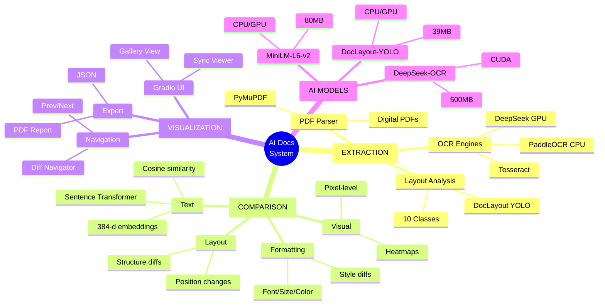
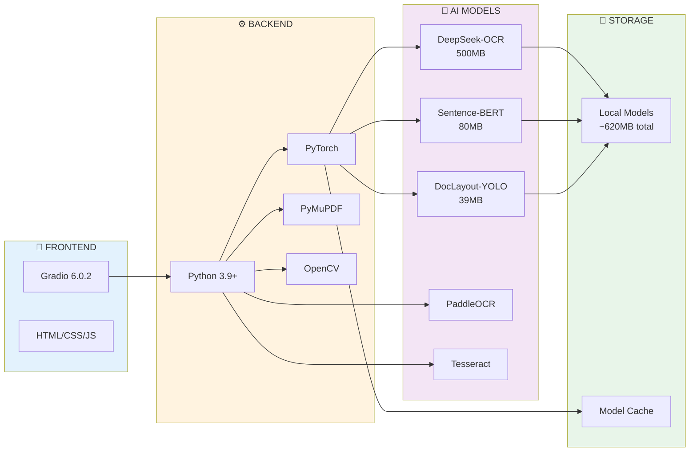
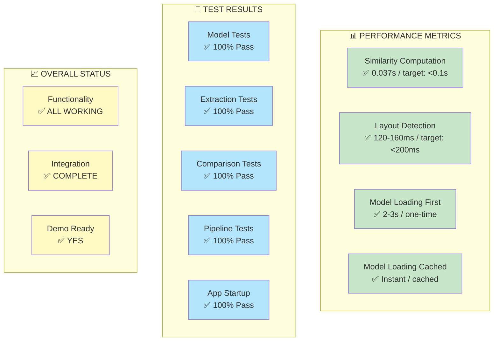
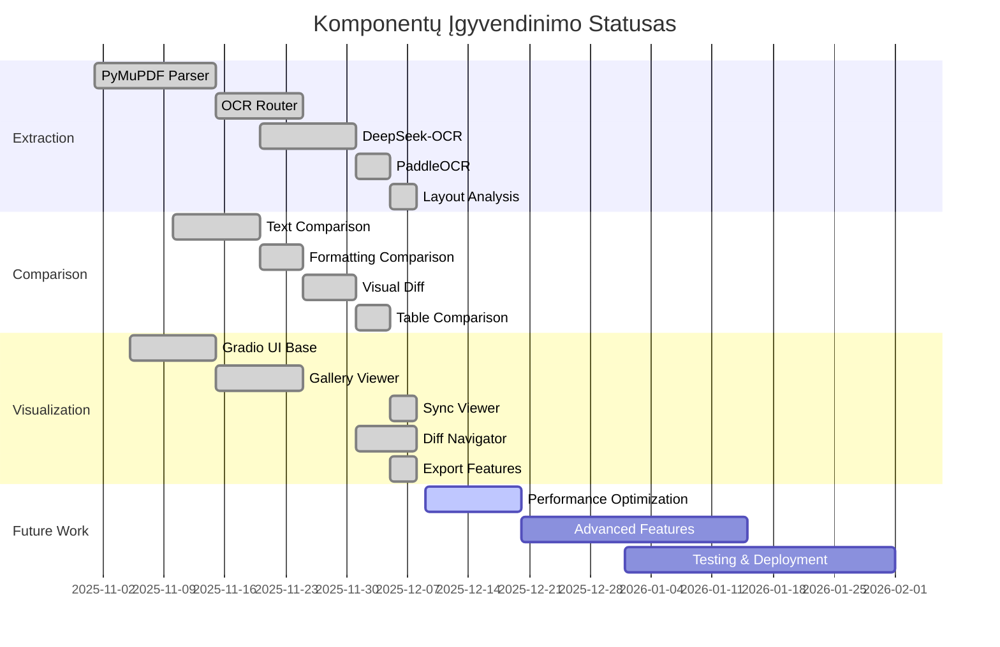
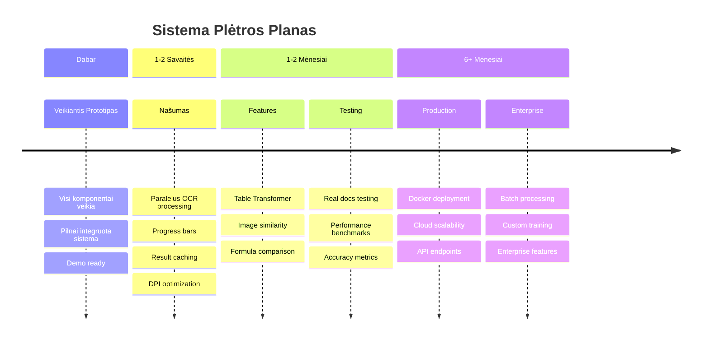
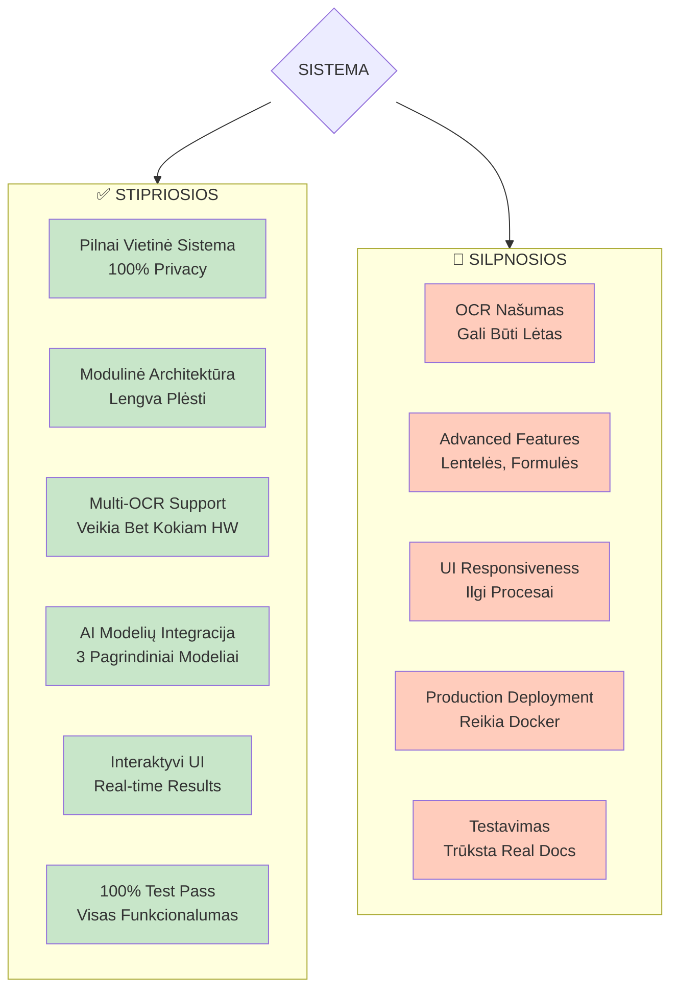

# AI Dokumentų Palyginimo Sistema - Santrauka

## 🎯 Vieno Puslapio Apžvalga

---

## Sistemos Flow

---

## Komponentų Žemėlapis

---

## Technologijų Stack

---

## Performance Dashboard

---

## Funkcionalumo Statusas

---

## Tobulinimo Roadmap

---

## Stipriosios vs Silpnosios Pusės

---

## Quick Facts

### 📊 Statistika

| Kategorija | Reikšmė |
|-----------|---------|
| **Kodo Eilutės** | ~10,000+ |
| **Python Failai** | ~30 |
| **AI Modeliai** | 5 (3 pagrindiniai) |
| **Total Model Size** | ~620MB |
| **Test Pass Rate** | 100% ✅ |
| **Moduliai** | 3 (extraction, comparison, viz) |
| **Dependencies** | ~15 core libraries |
| **UI Framework** | Gradio 6.0.2 |
| **Development Time** | ~3-4 savaitės |

### 🎯 Key Achievements

- ✅ Pilnai funkcionuojanti sistema
- ✅ 3 OCR varikliai su auto-fallback
- ✅ Real-time interactive UI
- ✅ 100% local processing
- ✅ Visi testai praeity
- ✅ Ready for demo

### 🚀 Next Steps Priority

1. **AUKŠTAS**: Našumo optimizacijos
2. **VIDUTINIS**: Advanced features
3. **VIDUTINIS**: UI/UX patobulinimai
4. **AUKŠTAS**: Production deployment
5. **VIDUTINIS**: Dokumentacija

---

## Sistema Veikia Dabar! 🎉

**URL**: http://localhost:7860

**Status**: ✅ RUNNING (48+ minutės)

**Komponentai**: ✅ ALL OPERATIONAL

---

**Sukurta**: 2025-12-09  
**Versija**: 1.0  
**Tikslas**: KTU P170M109 Projektas
