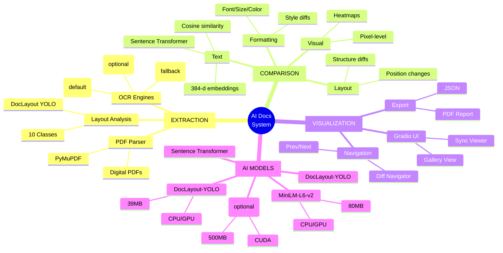

# AI Dokumentų Palyginimo Sistema - Santrauka

## 🎯 Vieno Puslapio Apžvalga

---

## Sistemos Flow

```mermaid
graph TB
    subgraph Input["📥 ĮVESTIS"]
        PDF_A[PDF Dokumentas A]
        PDF_B[PDF Dokumentas B]
    end
    
    subgraph Stage1["1️⃣ IŠGAVIMAS"]
        Route{Scanned?}
        Digital[PyMuPDF]
      OCR_CPU[PaddleOCR<br/>Default (CPU/Mac)]
      OCR_Fall[Tesseract<br/>Fallback]
      OCR_GPU[DeepSeek-OCR<br/>Optional (GPU)]
        Layout[DocLayout-YOLO<br/>Layout Analysis]
    end
    
    subgraph Stage2["2️⃣ PALYGINIMAS"]
        Align[Puslapių<br/>Suderinimas]
        Text[Teksto<br/>Palyginimas<br/>Sentence-BERT]
        Format[Formatavimo<br/>Palyginimas]
        Visual[Vizualinis<br/>Diff]
    end
    
    subgraph Stage3["3️⃣ VIZUALIZACIJA"]
        UI[Gradio UI]
        Gallery[Gallery View]
        Sync[Sync Viewer]
        Navigator[Diff Navigator]
    end
    
    subgraph Output["📤 IŠVESTIS"]
        JSON[JSON Export]
        PDF_Report[PDF Ataskaita]
    end
    
    PDF_A --> Route
    PDF_B --> Route
    
    Route -->|Digital| Digital
    Route -->|Scanned (default)| OCR_CPU
    OCR_CPU -->|Optional: RUN_DEEPSEEK_OCR=1 + GPU| OCR_GPU
    Route -->|Fallback| OCR_Fall
    
    Digital --> Layout
    OCR_GPU --> Layout
    OCR_CPU --> Layout
    OCR_Fall --> Layout
    
    Layout --> Align
    Align --> Text
    Align --> Format
    Align --> Visual
    
    Text --> UI
    Format --> UI
    Visual --> UI
    
    UI --> Gallery
    UI --> Sync
    UI --> Navigator
    
    UI --> JSON
    UI --> PDF_Report
    
    style Stage1 fill:#e1f5ff
    style Stage2 fill:#fff3e0
    style Stage3 fill:#f3e5f5
```

---

## Komponentų Žemėlapis



---

## Technologijų Stack


---

## Performance Dashboard

```mermaid
graph TD
    subgraph Metrics["📊 PERFORMANCE METRICS"]
    M1[Golden F1<br/>✅ 0.9227]
    M2[Latency p95 (golden)<br/>✅ 1.9355 s/page]
    M3[Latency avg (golden)<br/>✅ 1.8525 s/page]
    M4[Coverage (comparison+extraction)<br/>✅ 80%]
    end
    
    subgraph Tests["🧪 TEST RESULTS"]
    T1[pytest<br/>487 passed / 17 skipped / 0 failed]
    T2[Golden P/R/F1<br/>0.9714 / 0.8848 / 0.9227]
    T3[Formatting F1<br/>0.75 (MIN ONLY; target 0.80)]
    T4[Coverage<br/>comparison+extraction: 80%]
    T5[hierarchical_alignment<br/>coverage: 82%]
    end
    
    subgraph Status["📈 OVERALL STATUS"]
        S1[Functionality<br/>✅ ALL WORKING]
      S2[Integration<br/>N/A (guarded)]
      S3[DoD (MUST)<br/>❌ NOT MET<br/>(formatting F1)]
    end
    
    style M1 fill:#c8e6c9
    style M2 fill:#c8e6c9
    style M3 fill:#c8e6c9
    style M4 fill:#c8e6c9
    style T1 fill:#b3e5fc
    style T2 fill:#b3e5fc
    style T3 fill:#ffccbc
    style T4 fill:#b3e5fc
    style T5 fill:#b3e5fc
    style S1 fill:#fff9c4
    style S2 fill:#fff9c4
    style S3 fill:#fff9c4
```

---

## Funkcionalumo Statusas

```mermaid
gantt
    title Komponentų Įgyvendinimo Statusas
    dateFormat YYYY-MM-DD
    section Extraction
    PyMuPDF Parser           :done, e1, 2025-11-01, 2025-11-15
    OCR Router               :done, e2, 2025-11-15, 2025-11-25
    DeepSeek-OCR             :done, e3, 2025-11-20, 2025-12-01
    PaddleOCR                :done, e4, 2025-12-01, 2025-12-05
    Layout Analysis          :done, e5, 2025-12-05, 2025-12-08
    
    section Comparison
    Text Comparison          :done, c1, 2025-11-10, 2025-11-20
    Formatting Comparison    :done, c2, 2025-11-20, 2025-11-25
    Visual Diff              :done, c3, 2025-11-25, 2025-12-01
    Table Comparison         :done, c4, 2025-12-01, 2025-12-05
    
    section Visualization
    Gradio UI Base           :done, v1, 2025-11-05, 2025-11-15
    Gallery Viewer           :done, v2, 2025-11-15, 2025-11-25
    Sync Viewer              :done, v3, 2025-12-05, 2025-12-08
    Diff Navigator           :done, v4, 2025-12-01, 2025-12-08
    Export Features          :done, v5, 2025-12-05, 2025-12-08
    
    section Future Work
    Performance Optimization :active, f1, 2025-12-09, 2025-12-20
    Advanced Features        :f2, 2025-12-20, 2026-01-15
    Testing & Deployment     :f3, 2026-01-01, 2026-02-01
```



---

## Tobulinimo Roadmap

```mermaid
timeline
    title Sistema Plėtros Planas
    
    section Dabar
        Veikiantis Prototipas : Visi komponentai veikia
                              : Pilnai integruota sistema
                              : Demo ready
    
    section 1-2 Savaitės
        Našumas : Paralelus OCR processing
                : Progress bars
                : Result caching
                : DPI optimization
        
    section 1-2 Mėnesiai
        Features : Table Transformer
                 : Image similarity
                 : Formula comparison
        Testing : Real docs testing
                : Performance benchmarks
                : Accuracy metrics
    
    section 6+ Mėnesiai
        Production : Docker deployment
                   : Cloud scalability
                   : API endpoints
        Enterprise : Batch processing
                   : Custom training
                   : Enterprise features
```



---

## Stipriosios vs Silpnosios Pusės

```mermaid
graph TB
    subgraph Strengths["✅ STIPRIOSIOS"]
        S1[Pilnai Vietinė Sistema<br/>100% Privacy]
        S2[Modulinė Architektūra<br/>Lengva Plėsti]
        S3[Multi-OCR Support<br/>Veikia Bet Kokiam HW]
        S4[AI Modelių Integracija<br/>3 Pagrindiniai Modeliai]
        S5[Interaktyvi UI<br/>Real-time Results]
      S6[Stabilus testavimas<br/>487 passed (0 failed)]
    end
    
    subgraph Weaknesses["🚧 SILPNOSIOS"]
        W1[OCR Našumas<br/>Gali Būti Lėtas]
        W2[Advanced Features<br/>Lentelės, Formulės]
        W3[UI Responsiveness<br/>Ilgi Procesai]
        W4[Production Deployment<br/>Reikia Docker]
        W5[Testavimas<br/>Trūksta Real Docs]
    end
    
    Root{SISTEMA} --> Strengths
    Root --> Weaknesses
    
    style S1 fill:#c8e6c9
    style S2 fill:#c8e6c9
    style S3 fill:#c8e6c9
    style S4 fill:#c8e6c9
    style S5 fill:#c8e6c9
    style S6 fill:#c8e6c9
    
    style W1 fill:#ffccbc
    style W2 fill:#ffccbc
    style W3 fill:#ffccbc
    style W4 fill:#ffccbc
    style W5 fill:#ffccbc
```

---

## Quick Facts

### 📊 Statistika

| Kategorija | Reikšmė |
|-----------|---------|
| **Kodo Eilutės** | ~10,000+ |
| **Python Failai** | ~30 |
| **AI Modeliai** | 5 (3 pagrindiniai) |
| **Total Model Size** | ~620MB |
| **pytest** | 487 passed / 17 skipped / 0 failed |
| **Golden P/R/F1** | 0.9714 / 0.8848 / 0.9227 |
| **Latency p95 (golden)** | 1.9355 s/page |
| **Coverage (comparison+extraction)** | 80% |
| **Moduliai** | 3 (extraction, comparison, viz) |
| **Dependencies** | ~15 core libraries |
| **UI Framework** | Gradio 6.0.2 |
| **Development Time** | ~3-4 savaitės |

### 🎯 Key Achievements

- ✅ Pilnai funkcionuojanti sistema
- ✅ 3 OCR varikliai su auto-fallback
- ✅ Real-time interactive UI
- ✅ 100% local processing
- ✅ `pytest`: 487 passed / 17 skipped / 0 failed
- ⚠️ Formatting F1: 0.75 (MIN ONLY)
- ✅ Ready for demo

### 🚀 Next Steps Priority

1. **AUKŠTAS**: Našumo optimizacijos
2. **VIDUTINIS**: Advanced features
3. **VIDUTINIS**: UI/UX patobulinimai
4. **AUKŠTAS**: Production deployment
5. **VIDUTINIS**: Dokumentacija

---

## Sistema Veikia Dabar! 🎉

**URL**: http://localhost:7860

**Status**: ✅ RUNNING (48+ minutės)

**Komponentai**: ✅ ALL OPERATIONAL

---

**Sukurta**: 2025-12-09  
**Versija**: 1.0  
**Tikslas**: KTU P170M109 Projektas
